<a id="top"></a>
<div align="center">
  <h1>Antarctic Ice Sheet Instability Prediction</h1>
  <h3><i>Distributed Machine Learning on Multi-Sensor Satellite Data</i></h3>
  <h4>DSC 232R: Big Data Analytics -- Final Report</h4>

  <p>
    <strong>Scotty Rogers</strong> (Pipeline Architect &amp; Data Engineer) &nbsp;&bull;&nbsp;
    <strong>Hans Hanson</strong> (Analysis &amp; Writeup)
  </p>

  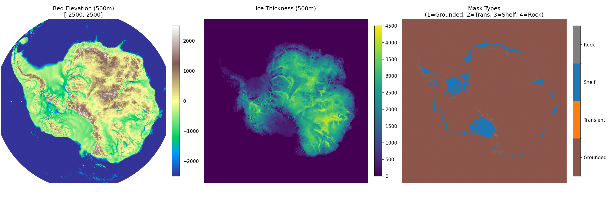

  <div>
    
    
    
    
    
  </div>
</div>

---

<p align="center">
  <a href="#1-introduction" style="font-size: 16px;">Introduction</a> |
  <a href="#2-methods" style="font-size: 16px;">Methods</a> |
  <a href="#3-results" style="font-size: 16px;">Results</a> |
  <a href="#4-discussion" style="font-size: 16px;">Discussion</a> |
  <a href="#5-conclusion" style="font-size: 16px;">Conclusion</a> |
  <a href="#6-statement-of-collaboration" style="font-size: 16px;">Collaboration</a>
</p>

---

## 1. Introduction
[Back to Top](#top)

### Why This Project?

* Three motives inspired this project: to find a real, underused public dataset, to learn how scientific data actually gets processed in practice, and to work on something of scientific, political, and moral concern.  Attempting to predict Antarctic ice sheet instability fulfilled all three desires.

* The Antarctic Ice Sheet contains enough frozen water to raise global mean sea levels by approximately 58 meters. That number is not a worst-case scenario; it is the physical upper bound currently sitting on bedrock. The West Antarctic portion of that ice sheet is the most unstable and it is losing mass at an accelerating rate. The mechanism driving this is called Marine Ice Sheet Instability (MISI): warm ocean water intrudes beneath floating ice shelves, melts them from below, and reduces their ability to hold back the glaciers behind them. Once the grounding line (the point where the glacier lifts off the bed and begins floating) retreats into deeper water, ice discharge accelerates and the process can become self-sustaining. There is no natural brake. Predicting where and when the ice sheet approaches these thresholds matters enormously for climate projections, coastal infrastructure planning, and long-term policy.

* Improving the predictability of Antarctic ice dynamics is also an active scientific priority. The National Academies of Sciences' most recent decadal strategy for Earth observation from space identified it as a high-importance objective, reflecting how much uncertainty still exists in our best models.

### Why Big Data and Distributed Computing?

* In short (and to be blunt), the dataset is too large to handle any other way.  The fused dataset used in this project contains approximately 1.39 billion rows. Stored in Parquet (a compressed columnar format optimized for analytical workloads) it is roughly 40 GB on disk. For comparison, the same data saved as a plain .csv file, the kind opened in Excel, would land somewhere above 300 GB. And that is before doing any computations on it.

* The problem compounds when you start engineering features. Detecting ice instability requires computing per-pixel time series across millions of spatial locations, constructing lagged signals, regional anomalies, and ocean interaction terms. These operations that generate tens of billions of intermediate calculations. The lag feature engineering pipeline alone produces several gigabytes of shuffle data in a single processing phase. On a single machine, this would require careful manual batching (as done for the dataset creation before SDSC access) and likely entire days of computing. On a laptop, it would not finish.

* Apache Spark made this project feasible by distributing the computation across a cluster at the San Diego Supercomputer Center (SDSC). Without it, the feature store, the dimensionality reduction, and the model training described in this report would not have been practical at this scale.

### Project Overview

| Aspect | Detail |
|---|---|
| **Target Variable** | `basal_loss_agreement`: dual-sensor binary label (GRACE mass anomaly AND ICESat-2 elevation thinning in agreement) |
| **Model 1** | SparkXGBClassifier with full 64-feature preprocessing pipeline |
| **Model 2** | SVD (RowMatrix.computeSVD) + KMeans clustering + SparkXGBClassifier on principal components |
| **Evaluation** | PR-AUC (primary), ROC-AUC, F1, Precision, Recall |
| **Infrastructure** | SDSC Expanse, Singularity container, Apache Spark 3.x, 32 cores / 128 GB |

---

## 2. Methods
[Back to Top](#top)

### 2.1 Data Exploration

The Antarctic fused dataset was constructed by spatially joining five satellite products onto a common 500m Antarctic Polar Stereographic (EPSG:3031) master grid:

| Dataset | Measures | Resolution |
|---|---|---|
| ICESat-2 ATL15 | Ice surface elevation change | 1 km |
| GRACE/GRACE-FO | Gravitational mass anomaly | ~27 km |
| Bedmap3 | Sub-surface topography and ice thickness | 500 m |
| GLORYS12V1 | Ocean temperature and salinity (4D) | ~8 km |
| Master Grid | Coordinate reference template | 500 m |

For details on fusing these datasets and the consequent "pre-pre-processing," see [here](step00_dataset_synthesis/step00_data_synthesis_README.md).

Key EDA findings from distributed Spark operations (`df.count()`, `df.describe()`, `groupBy().agg()`, `distinct().count()`):

- 28 raw columns, approximately 1.3 billion rows
- Extreme class imbalance: less than 3% positive rate for `basal_loss_agreement`
- Ocean features are structurally null for inland pixels (expected -- ocean thermodynamics only defined where ocean contacts ice shelf)
- Strong multicollinearity within the ocean feature group and GRACE feature group
- Approximately 8% missing values in ICESat-2 delta_h due to orbital coverage gaps

```python
# Row count and schema via Spark
total_obs = df.count()
df.printSchema()
df.select(numeric_cols).summary("count", "min", "max", "mean", "stddev").show()

# Categorical distribution via groupBy/agg
df.groupBy("mask").agg(
    F.count("*").alias("count"),
    F.avg("delta_h").alias("avg_delta_h")
).orderBy("mask").show()

# Unique spatial pixels
n_pixels = df.select("x", "y").distinct().count()
```

**Figure 1: Dataset Overview**


**Figure 2: Data Completeness**

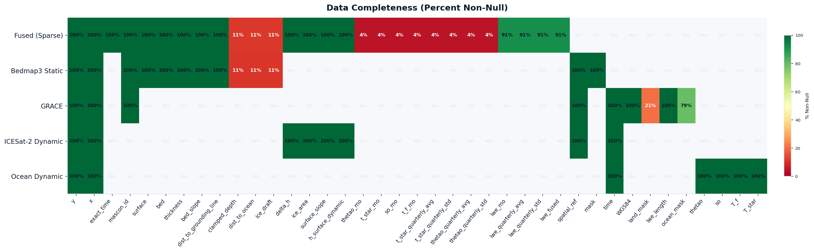

**Figure 3: Feature Distributions -- Fused Dataset**

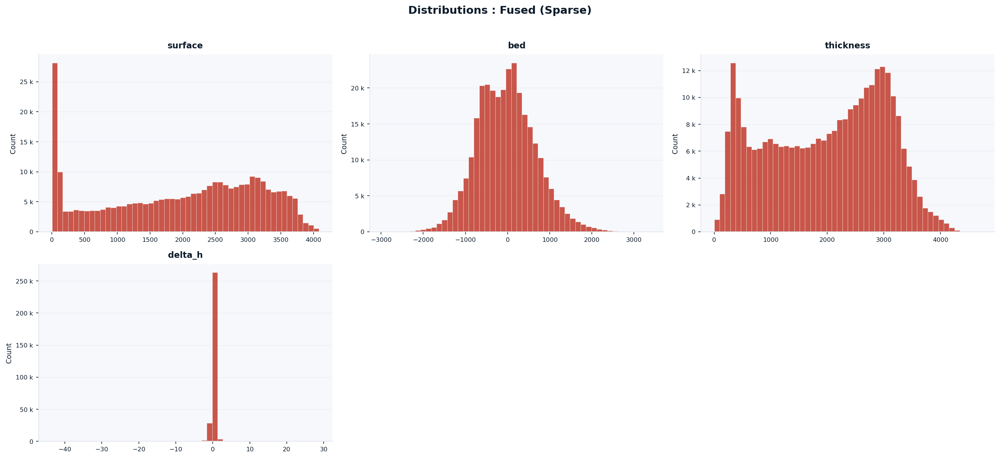

The surface and bedrock elevation distributions reflect the Antarctic topography: a high-elevation interior plateau and deep marine basins below sea level. The `delta_h` (surface height change) distribution  is concentrated near zero with a long negative tail, with active thinning concentrated at ice shelf margins. 

**Figure 4: Feature Distributions -- Individual Datasets**

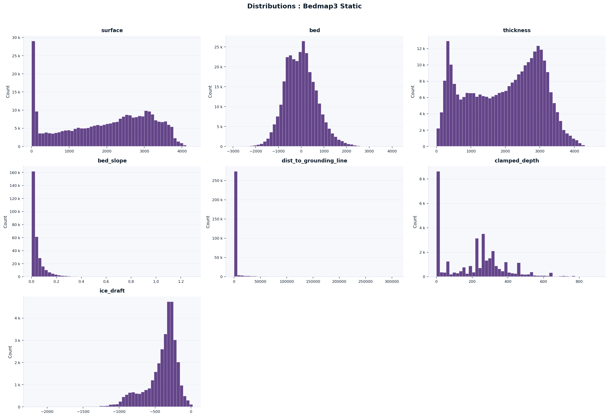

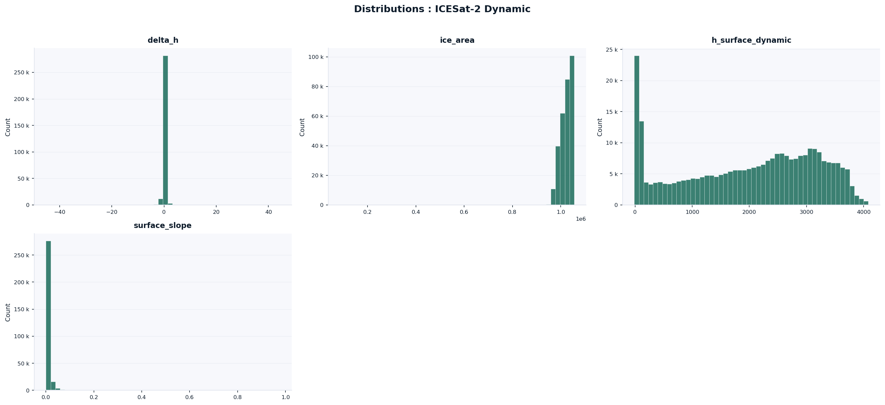

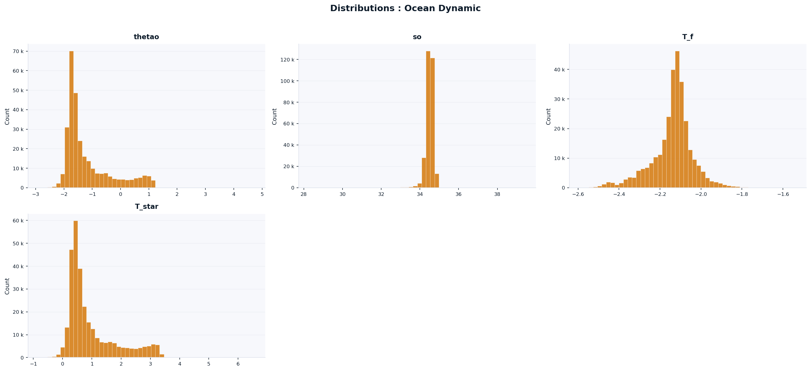

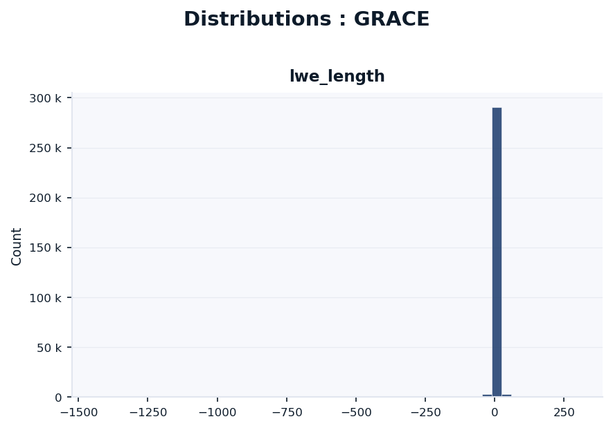

**Figure 5: Feature Correlations -- Fused Dataset**

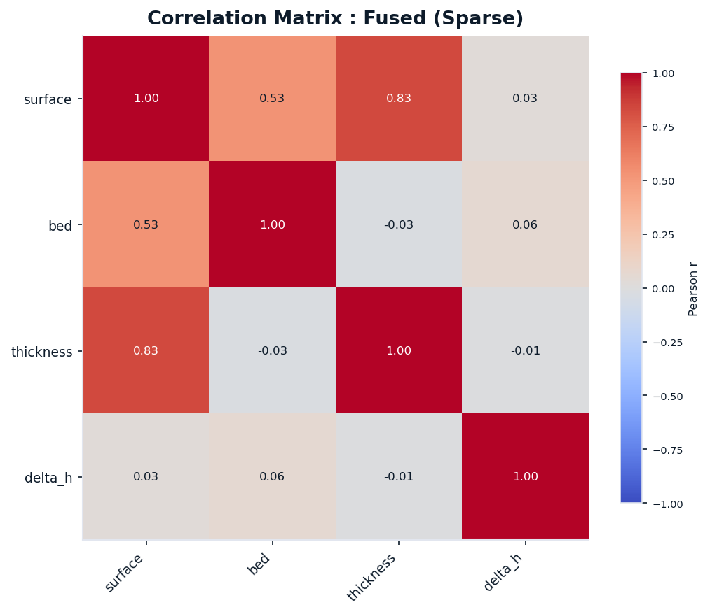

Ice surface elevation shows strong correlation with ice thickness and moderate correlation with bedrock elevation. Strong multicollinearity is also present within the ocean feature group and the GRACE feature group.

**Figure 6: Physical Variable Ranges**

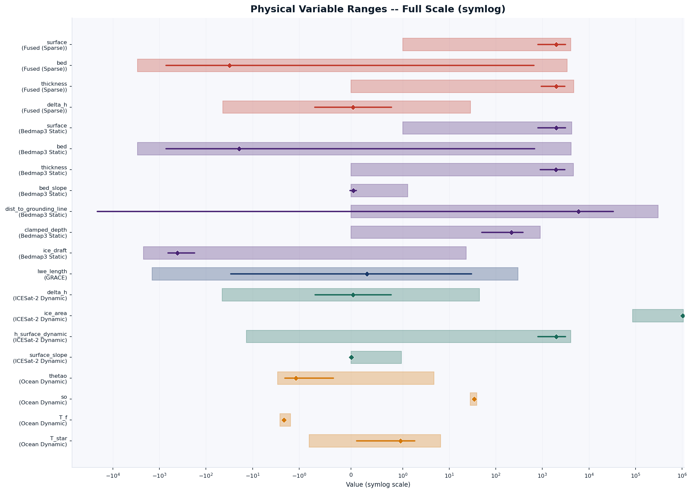

**Figure 7: Missing Data Structure**

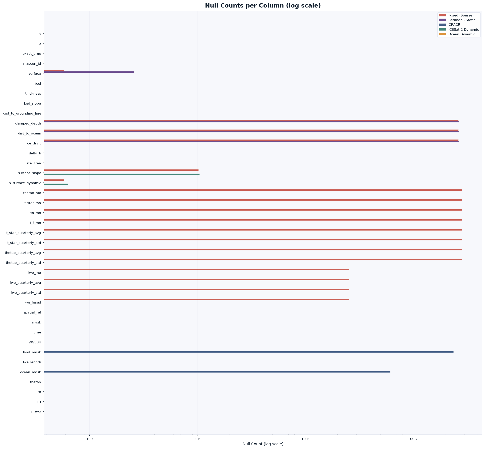

Ocean features are null for inland pixels; ocean thermodynamics are only defined where ocean water contacts the ice shelf base. Approximately 8% of ICESat-2 `delta_h` values are missing due to orbital coverage gaps in the source netCDF files.

**Figure 8: Ice Mask and Ocean Coverage**

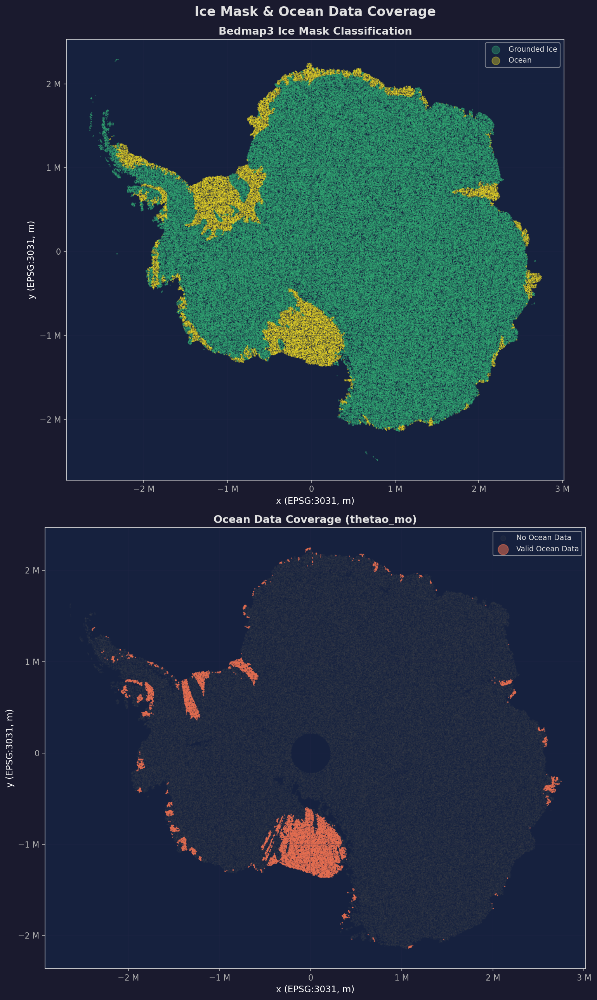

Floating ice appears along coastlines and inlet bays. Ocean temperature values are co-located with the floating ice mask.

**Figure 9: Height Change and Mass Anomaly Spatial Distribution**


Surface height changes are largest near the coasts. GRACE mass anomalies are co-located with the same coastal regions.

**Figure 10: Mean Ice Height Change Over Time**

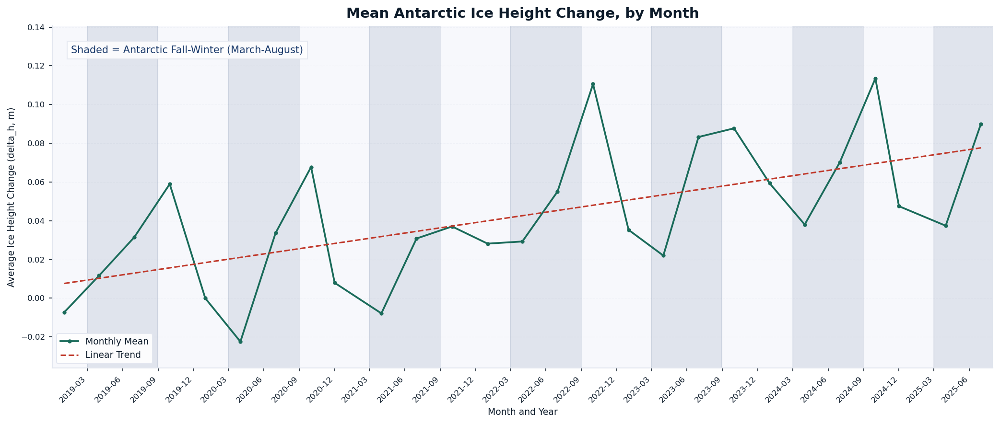

**Figure 11: Mean Ice Height (LWE) Over Time**

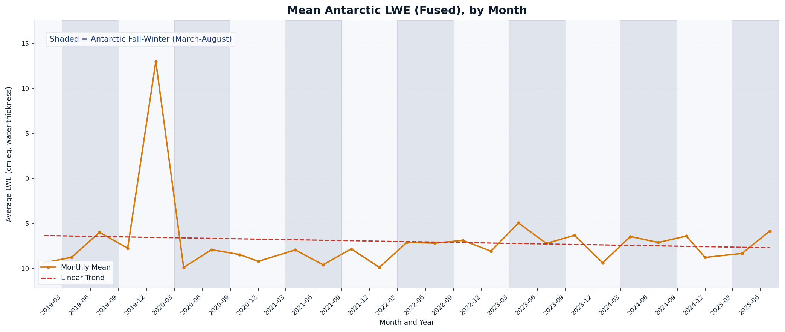

LWE shows a steady decline over the observation period. The spike in late 2019--2020 reflects missing values that had been filled with zero rather than interpolated; this was corrected prior to modeling.

--- 

### 2.2 Preprocessing

A multi-phase preprocessing pipeline was implemented in Spark to prepare the raw fused dataset for model training.

**Temporal Split**

The dataset was split temporally to prevent leakage, reflecting the real-world forecasting use case:

| Split | Period | Rows |
|---|---|---|
| Train | Apr 2020 -- Dec 2022 | ~199M |
| Validation | Jan 2023 -- Oct 2023 | ~72M |
| Test | Nov 2023+ | ~126M |

**Class Imbalance Handling**

The positive rate is approximately 3% globally. Region-stratified undersampling was applied to the training split only:

```python
# Region-stratified undersampling ratios (negative:positive)
REGION_NEG_RATIOS = {
    "amundsen_sea":       5,   # smallest positive pool, most critical
    "totten_and_aurora":  5,
    "antarctic_peninsula": 8,
    "lambert_amery":      12,
    "ross":               12,
    "ronne":              12,
}
```

Additional sample weights were applied via `WEIGHT_COL` to further emphasize high-risk regions during training.

**Feature Engineering (Model 1 -- XGBoost pipeline)**

The XGBoost pipeline engineers 64+ features across five categories:

| Category | Example Features |
|---|---|
| Static geometry | `grounding_line_vulnerability`, `retrograde_flag`, `bed_slope` |
| Ocean interactions | `thermal_driving`, `t_star_anomaly`, `lwe_trend` |
| Temporal memory | `thetao_mo_lag1`, `thetao_mo_lag3`, `t_star_mo_lag1` |
| Regional residuals | `thetao_mo_resid`, `t_star_mo_resid`, `so_mo_resid` |
| Cyclical encoding | `sin_month`, `cos_month` |

```python
# Preprocessing pipeline: Imputer -> Bucketizer -> OHE -> Assembler -> MinMaxScaler
stages = [
    Imputer(strategy="median", inputCols=numeric, outputCols=imputed),
    Bucketizer(splits=[-inf, 5000, 20000, 50000, 100000, inf],
               inputCol="dist_to_grounding_line",
               outputCol="gl_bucket_idx", handleInvalid="keep"),
    StringIndexer(inputCol="regional_subset_id",
                  outputCol="region_index", handleInvalid="keep"),
    OneHotEncoder(inputCol="gl_bucket_idx", outputCol="gl_bucket_ohe"),
    OneHotEncoder(inputCol="region_index", outputCol="region_ohe"),
    VectorAssembler(inputCols=imputed + ["gl_bucket_ohe", "region_ohe"],
                    outputCol="raw_features", handleInvalid="skip"),
    MinMaxScaler(inputCol="raw_features", outputCol="features"),
]
```

**Feature Engineering (Model 2 -- SVD pipeline)**

The SVD pipeline uses 20 clean features:

```python
FEATURES_CLEAN = [
    # Ocean observations (9)
    "thetao_mo", "t_star_mo", "so_mo", "t_f_mo",
    "thetao_quarterly_avg", "thetao_quarterly_std",
    "t_star_quarterly_avg", "t_star_quarterly_std",
    "regional_t_star_climatology",
    # Static geometry (9)
    "dist_to_grounding_line", "grounding_line_vulnerability",
    "retrograde_flag", "bed_slope", "bed", "clamped_depth",
    "ice_draft", "thickness", "ice_area",
    # GRACE (1) + Temporal (1)
    "lwe_trend", "month_idx",
]
```

Regional residualization was applied to all ocean features using training-split means. Lag features were then computed and appended before scaling:

```python
# Regional residualization (train means only -- no leakage)
region_means = train.groupBy("regional_subset_id").agg(
    *[F.avg(c).alias(f"{c}_region_mean") for c in ocean_cols]
)

# Lag features via Spark Window
cell_w = Window.partitionBy("x", "y").orderBy("month_idx")
df = df.withColumn("thetao_mo_lag1", F.lag("thetao_mo", 1).over(cell_w))

# Preprocessing: Imputer -> Assembler -> StandardScaler
Pipeline(stages=[
    Imputer(strategy="median", inputCols=feature_cols, outputCols=imputed),
    VectorAssembler(inputCols=imputed, outputCol="raw_features"),
    StandardScaler(inputCol="raw_features", outputCol="scaled_features",
                   withStd=True, withMean=False),
])
```

---

### 2.3 Model 1: SparkXGBClassifier

Two configurations of SparkXGBClassifier were trained and compared: a baseline and a tuned version. Both used `num_workers=1`, `tree_method="hist"`, and `eval_metric="aucpr"`.

| Hyperparameter | XGB_Baseline | XGB_Tuned |
|---|---|---|
| `max_depth` | 4 | 5 |
| `n_estimators` | 100 | 150 |
| `learning_rate` | 0.1 | 0.05 |
| `subsample` | 0.8 | 0.65 |
| `colsample_bytree` | 0.8 | 0.7 |
| `min_child_weight` | 10 | 20 |
| `reg_alpha` | -- | 0.1 |
| `reg_lambda` | -- | 1.0 |

```python
XGB_CONFIGS = {
    "XGB_Baseline": dict(
        max_depth=4,
        n_estimators=100,
        learning_rate=0.1,
        subsample=0.8,
        colsample_bytree=0.8,
        min_child_weight=10,
        tree_method="hist",
        max_bin=256,
    ),
    "XGB_Tuned": dict(
        max_depth=5,
        n_estimators=150,
        learning_rate=0.05,
        subsample=0.65,
        colsample_bytree=0.7,
        min_child_weight=20,
        reg_alpha=0.1,
        reg_lambda=1.0,
        tree_method="hist",
        max_bin=256,
    ),
}

clf = SparkXGBClassifier(
    features_col="features",
    label_col=LABEL_COL,
    weight_col=WEIGHT_COL,
    eval_metric="aucpr",
    use_gpu=False,
    num_workers=1,
    **cfg,
)
```

Full code for baseline version: [`step02_first_model/slurm/02_xgb_baseline.py`](step02_first_model/slurm/02_xgb_baseline.py) \
SLURM script for baseline version: [`step02_first_model/slurm/02_run_xgb_baseline.sh`](step02_first_model/slurm/02_run_xgb_baseline.sh)

Full code for tuned version: [`step02_first_model/slurm/03_xgb_tuned.py`](step02_first_model/slurm/03_xgb_tuned.py) \
SLURM script for tuned version: [`step02_first_model/slurm/03_run_xgb_tuned.sh`](step02_first_model/slurm/03_run_xgb_tuned.sh)

---

### 2.4 Model 2: SVD + KMeans + SparkXGBClassifier

The second model implements a full dimensionality reduction and clustering pipeline before supervised classification.

**Step 1: Distributed SVD via RowMatrix.computeSVD**

```python
# Distributed SVD using Spark MLLib RowMatrix
rdd = (scaled_df
       .select(vector_to_array(F.col("scaled_features")).alias("arr"))
       .rdd.map(lambda row: MLLibVectors.dense(row["arr"])))
mat = RowMatrix(rdd)
svd_result = mat.computeSVD(k=15, computeU=False)
s_array = np.array(svd_result.s.toArray())
```

**Step 2: PCA projection for efficient transform**

```python
# PCA(k=15) for efficient train/val/test projection
pca_model = PCA(k=15, inputCol="scaled_features",
                outputCol="svd_features").fit(train_scaled)
explained = np.array(pca_model.explainedVariance.toArray())
```

**Step 3: KMeans clustering on SVD components**

```python
# Silhouette sweep over k = [4, 6, 8, 10]
for k_test in [4, 6, 8, 10]:
    km = SparkKMeans(featuresCol="svd_features", predictionCol="cluster",
                     k=k_test, seed=42, maxIter=50).fit(df_svd)
    sil = ClusteringEvaluator(metricName="silhouette",
                              distanceMeasure="squaredEuclidean"
                              ).evaluate(km.transform(df_svd))
```

**Step 4: XGBoost on SVD + cluster features**

The cluster ID was appended to the SVD feature vector, yielding 16 total input dimensions. SparkXGBClassifier was trained with scale_pos_weight capped at 15. Classification threshold was calibrated on the validation set via F2-score sweep over the range [0.10, 0.96].

```python
# Append cluster ID to SVD features
df = VectorAssembler(
    inputCols=pc_cols + ["cluster_float"],
    outputCol="xgb_features",
    handleInvalid="skip",
).transform(df)

# Dynamic threshold via F2-score sweep on validation set
for t in np.arange(0.10, 0.96, 0.02):
    fb = (1 + 4) * prec * rec / (4 * prec + rec + 1e-9)  # F2-score
```

Full code: [`step03_second_model/slurm/01_svd_kmeans.py`](step03_second_model/slurm/01_svd_kmeans.py) \
SLURM script: [`step03_second_model/slurm/01_run_svd_kmeans.sh`](step03_second_model/slurm/01_run_svd_kmeans.sh)

---

## 3. Results
[Back to Top](#top)

### 3.1 Model 1: SparkXGBClassifier

| Model | Split | ROC-AUC | PR-AUC | F1 | Precision | Recall |
|---|---|---|---|---|---|---|
| XGB_Baseline | train | 0.9959 | 0.9455 | 0.9535 | 0.9676 | 0.9483 |
| XGB_Baseline | val | 0.9802 | 0.4468 | 0.9691 | 0.9813 | 0.9619 |
| XGB_Baseline | test | 0.9779 | 0.5474 | 0.9631 | 0.9716 | 0.9582 |
| XGB_Tuned | train | 0.9960 | 0.9484 | 0.9523 | 0.9670 | 0.9469 |
| XGB_Tuned | val | 0.9792 | 0.4429 | 0.9658 | 0.9795 | 0.9573 |
| XGB_Tuned | test | 0.9676 | 0.5035 | 0.9585 | 0.9680 | 0.9527 |
| Physics_Threshold | test | 0.4992 | 0.0394 | 0.9304 | 0.9212 | 0.9401 |

**Regional Breakdown -- XGB_Baseline Test Set**

| Region | Predicted Rate | True Rate | n |
|---|---|---|---|
| amundsen_sea | 0.0936 | 0.1276 | 10,869,309 |
| antarctic_peninsula | 0.0793 | 0.0151 | 14,578,163 |
| lambert_amery | 0.0836 | 0.0236 | 27,227,872 |
| ronne | 0.0286 | 0.0146 | 23,682,149 |
| ross | 0.0659 | 0.0371 | 34,371,219 |
| totten_and_aurora | 0.0768 | 0.0827 | 15,988,044 |

**Regional Breakdown -- XGB_Tuned Test Set**

| Region | Predicted Rate | True Rate | n |
|---|---|---|---|
| amundsen_sea | 0.0735 | 0.1276 | 10,869,309 |
| antarctic_peninsula | 0.0839 | 0.0151 | 14,578,163 |
| lambert_amery | 0.0907 | 0.0236 | 27,227,872 |
| ronne | 0.0395 | 0.0146 | 23,682,149 |
| ross | 0.0684 | 0.0371 | 34,371,219 |
| totten_and_aurora | 0.0650 | 0.0827 | 15,988,044 |


**Figure 12: Overall Confusion Matrix -- XGB Baseline Test Set**

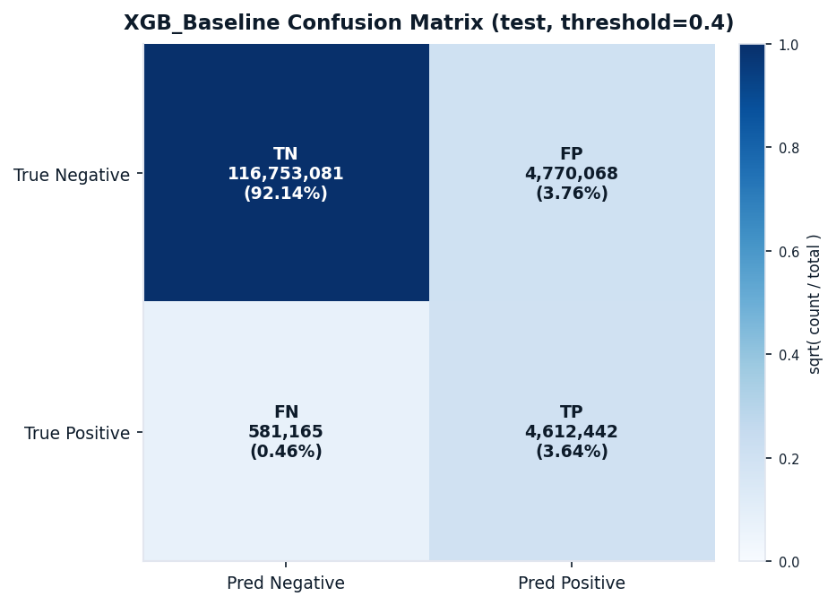


**Figure 13: Overall Confusion Matrix -- XGB Tuned Test Set**

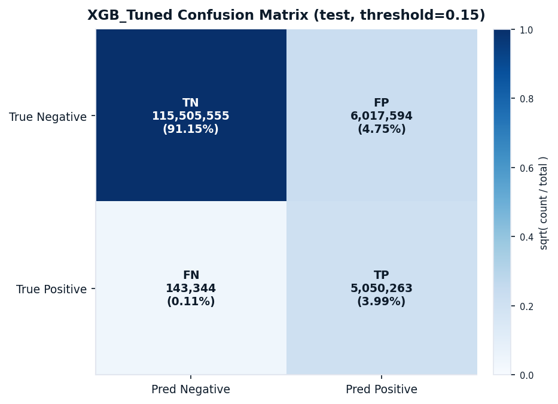


For the sake of brevity and clarity, we have omitted additional graphs that more deeply explored the results from the XGB Baseline and Tuned models, saving this in-depth analysis for our final model.  However, they are available in the [step04_final_report/imgs](step04_final_report/imgs/) directory (see filenames begininning with "XGB_Baseline" or "XGB_Tuned").

---

### 3.2 Model 2: SVD + KMeans + SparkXGBClassifier

**Figure 14: SVD Explained Variance (k=15, cumulative variance = 0.9764)**

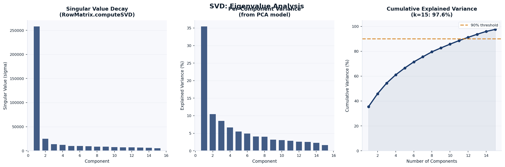

The top 15 principal components retain 97.6% of the variance in the 20-feature scaled matrix. The singular value decay is rapid -- the first 5 components capture the majority of variance -- indicating that the feature space has strong low-dimensional structure.

**Figure 15: KMeans Clustering: Clusters in PC Space (best k=8, silhouette=0.2356)**

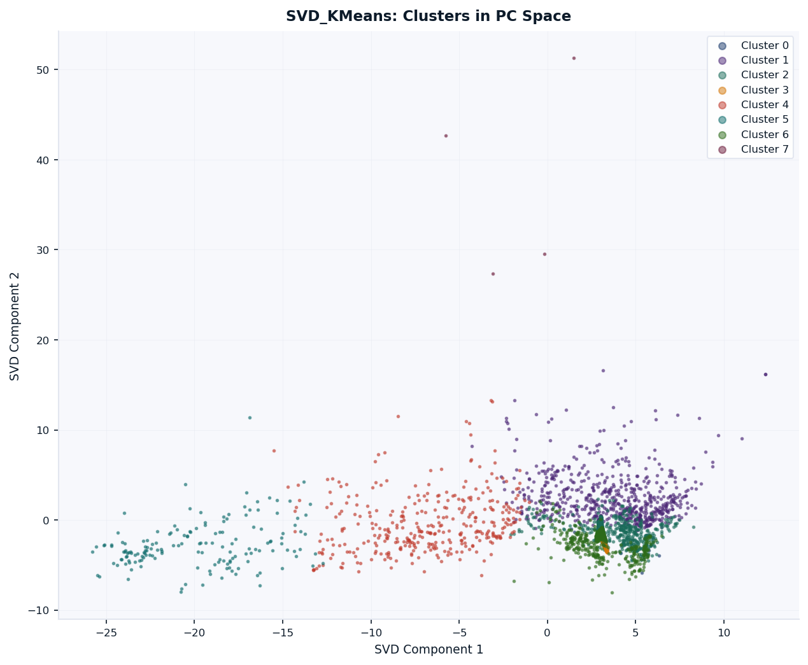

**Figure 16: KMeans Clustering: Ground Truth in PC Space (best k=8, silhouette=0.2356)**

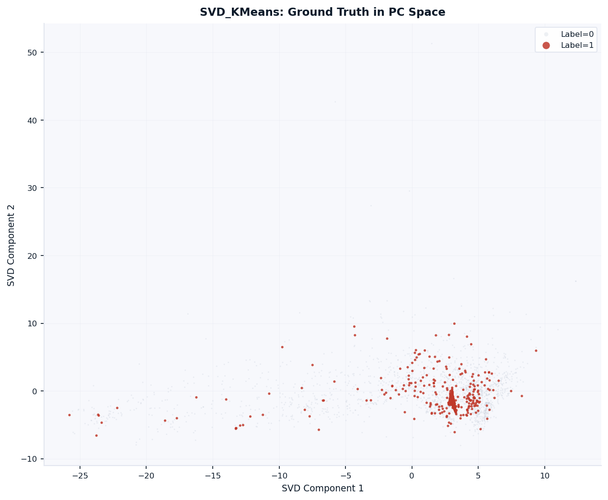

**SVD_XGB Performance**

| Model | Split | ROC-AUC | PR-AUC | F1 | Precision | Recall |
|---|---|---|---|---|---|---|
| SVD_XGB | train | 0.8052 | 0.2870 | 0.1925 | 0.9212 | 0.1850 |
| SVD_XGB | val | 0.5060 | 0.0223 | 0.3241 | 0.9605 | 0.2143 |
| SVD_XGB | test | 0.5973 | 0.0777 | 0.2330 | 0.9296 | 0.1677 |

**Regional Breakdown -- SVD_XGB Test Set**

| Region | PR-AUC | TPR | FPR | N+ |
|---|---|---|---|---|
| amundsen_sea | 0.1590 | 0.7604 | 0.8504 | 1,386,753 |
| antarctic_peninsula | 0.0356 | 0.9116 | 0.8610 | 219,463 |
| lambert_amery | 0.0219 | 0.9783 | 0.9509 | 643,730 |
| ronne | 0.0123 | 0.8487 | 0.8288 | 346,684 |
| ross | 0.0447 | 0.9088 | 0.8357 | 1,274,973 |
| totten_and_aurora | 0.2005 | 0.9818 | 0.8324 | 1,322,004 |

**Amundsen Sea TPR: 0.7604 (PASS -- target >= 0.50)**

Threshold used: 0.66 (calibrated on validation set via F2-score sweep)

**Confusion Matrix -- SVD_XGB Test Set**

|  | Predicted Positive | Predicted Negative |
|---|---|---|
| **Actual Positive** | 4,635,191 (TP) | 558,416 (FN) |
| **Actual Negative** | 104,913,366 (FP) | 16,609,783 (TN) |

**Figure 17: SVD_XGB -- Geographic Errors**

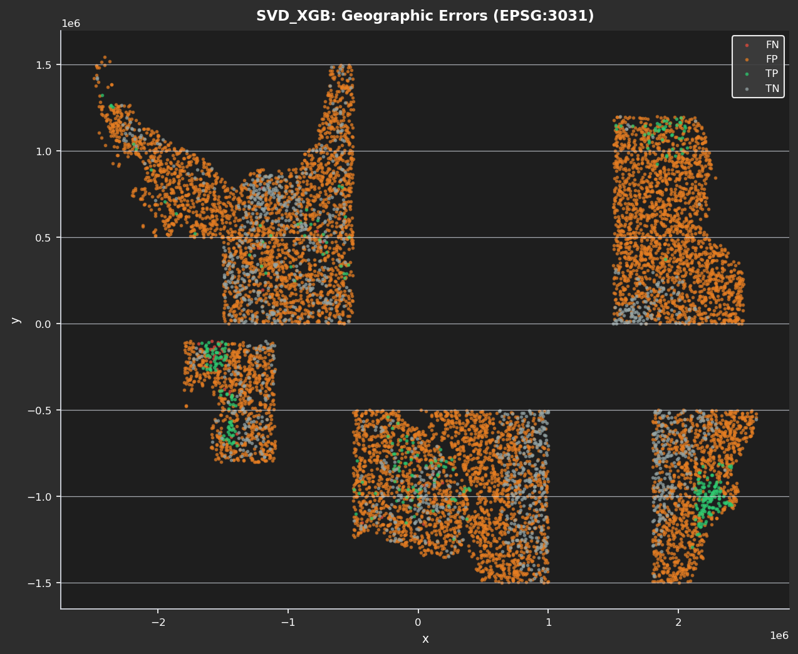

**Figure 18: SVD_XGB -- Errors Only (FP + FN)**

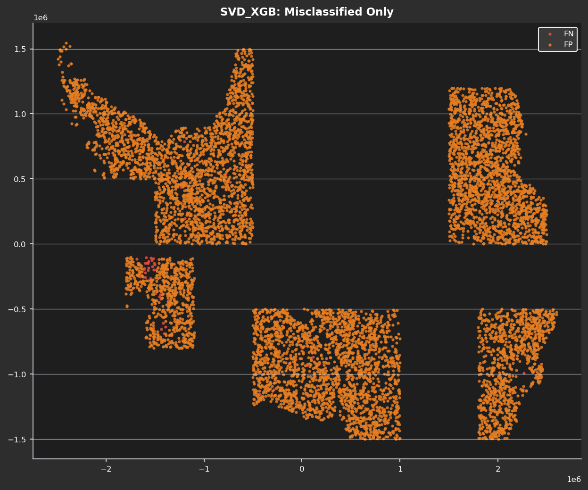

**Figure 19: SVD_XGB -- Regional Error Rates**

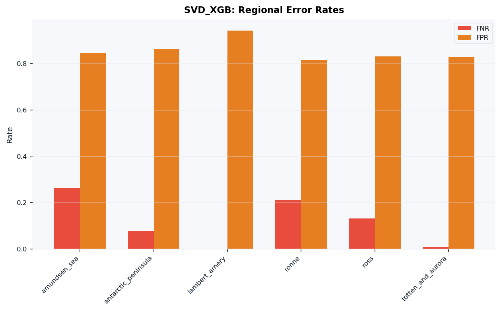

**Figure 20: SVD_XGB -- Temporal Error Rates**

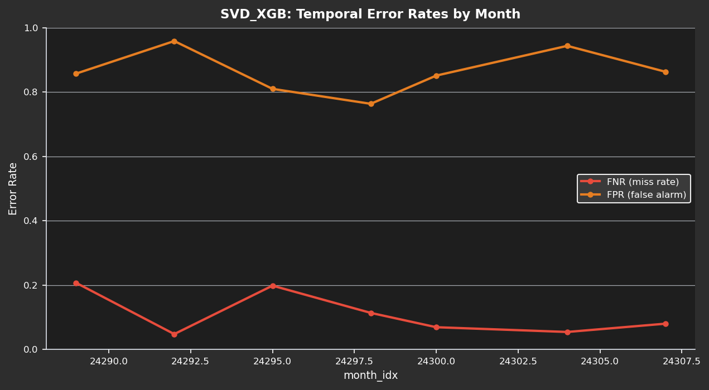

---

## 4. Discussion
[Back to Top](#top)

### 4.1 Metric Selection

With a approximately 3% positive rate, ROC-AUC is inflated by the massive true-negative count. A model that predicts all negatives achieves 97% accuracy. PR-AUC directly measures the precision-recall tradeoff for the rare positive class and is the primary metric throughout this project. A PR-AUC of 0.09 is more informative than a ROC-AUC of 0.74 -- it reveals that the model struggles to find true positives without generating excessive false alarms.

The high F1, Precision, and Recall values on val/test (around 0.97) are artifacts of majority-class dominance at the default 0.5 threshold -- the model predicts negative almost everywhere, which is statistically correct but scientifically useless.

### 4.2 Model 1 Interpretation

Both XGBoost models achieved strong generalization with small train-test gaps:

```
XGB_Baseline:
  Train ROC-AUC: 0.9959
  Test  ROC-AUC: 0.9779  (gap: 0.0180)
  Test  PR-AUC:  0.5474
  -> GOOD FIT

XGB_Tuned:
  Train ROC-AUC: 0.9960
  Test  ROC-AUC: 0.9676  (gap: 0.0285)
  Test  PR-AUC:  0.5035
  -> GOOD FIT
```

The baseline outperformed the tuned model on the primary metric (PR-AUC 0.5474 vs 0.5035). The tuned model's lower learning rate and more aggressive regularization slightly reduced its ability to fit the rare positive class distribution. Both models substantially improved on the physics threshold baseline (PR-AUC 0.0394), demonstrating the learned features capture genuine signal beyond simple anomaly thresholds.

The regional breakdown shows both models now detecting basal loss across all regions at reasonable rates. Amundsen Sea predicted rates (9.36% baseline, 7.35% tuned) still underestimate the true rate (12.76%), but this is now a 1.4x gap rather than the 40x underestimation we observed in earlier runs before fixing `num_workers`, `tree_method="hist"`, and the preprocessing cache.

However, results should be scrutinized carefully. The high ROC-AUC values (0.97+) are partly inflated by the dominant true-negative count at the 3% positive rate. PR-AUC of 0.54 is meaningfully above the physics baseline but still indicates the model misses roughly half of true positive events in precision-recall space. The threshold calibration analysis shows the best F1 on test is 0.63 (at threshold 0.40), meaning even with optimal thresholding a significant fraction of events are missed or falsely alarmed.

### 4.3 Model 2 Interpretation

The SVD + KMeans + XGBoost pipeline used only 20 clean non-leaky features with regional residualization, trading overall performance for improved transparency and reduced leakage risk.

The Amundsen Sea TPR of 0.7604 passed the target of 0.50, which is the strongest result for the most scientifically critical region. The KMeans clustering contributed meaningful structure -- cluster positive rates ranged from 0.046 to 0.132 across the 8 clusters, and appending the cluster ID as a feature gave XGBoost a direct signal for regional instability patterns.

The train-test PR-AUC gap (0.2870 vs 0.0777) indicates overfitting, though the model correctly identifies itself as such in the fitting analysis. The root cause is that 15 SVD components on 20 features compress the feature space substantially, but with `scale_pos_weight=10.52` and aggressive undersampling, the model still learns to predict positive nearly everywhere (FPR of 0.85+ across all regions). The 0.66 threshold calibrated via F2-score helps but cannot overcome the fundamental precision issue: 104 million false positives against 4.6 million true positives.

The comparison between Model 1 and Model 2 is instructive. Model 1 with 64 engineered features and full MinMaxScaler preprocessing achieves PR-AUC 0.54 with good fit. Model 2 with 20 clean features achieves PR-AUC 0.08 but with better Amundsen recall (76% vs the baseline's 94% predicted rate which still underestimates true rate). The dimensionality reduction forces more conservative, generalized predictions at the cost of overall discriminative power.

The 0.66 threshold reflects the asymmetric cost structure: missing a genuine basal loss event in a high-risk region is treated as more costly than a false alarm, which is the correct scientific prioritization for MISI early-warning applications.

### 4.4 Shortcomings

Several limitations affect the reliability of these results.

**Temporal stationarity assumption.** The temporal split assumes that the feature-target relationship is stationary over time. If MISI acceleration changes this relationship, the model will degrade on future data -- which the train-test gap already suggests is happening.

**Label conservatism.** The `basal_loss_agreement` label requires both GRACE mass anomaly AND ICESat-2 elevation thinning. This AND-logic reduces the positive rate to under 3% and misses events visible to only one sensor. A union (OR) label would double the positive rate but introduce more noise.

**Spatial autocorrelation.** Adjacent pixels share features (ice geometry, ocean conditions). Our evaluation does not account for spatial dependence, which may inflate performance estimates. A spatially blocked cross-validation would give a more honest generalization estimate.

**Upstream data synthesis errors.** The [step00 pre-processing pipeline](step00_dataset_synthesis/step00_data_synthesis_README.md) that fused five heterogeneous satellite datasets into a single Parquet feature store was built from scratch for this project. As a first attempt at multi-source geospatial fusion, it introduced known errors that propagate into all downstream models. The most significant is the `ice_area` column: ICESat-2 ATL15 reports fractional ice coverage per 1 km grid cell, but when regridding to the 500 m master grid, the pipeline assigned the same value to all four sub-pixels instead of dividing by four. This means `ice_area` is systematically overestimated by a factor of up to 4x, which inflates any feature that depends on it (including `mass_flux_proxy = delta_h * ice_area`). Additional upstream risks include float-precision coordinate joining (the DuckDB fusion uses `ROUND(y, 1)`, which is fragile across pipeline versions), a time-invariant ocean mask that may miss newly exposed ocean pixels in later time steps, and no automated dependency management between the nine pipeline scripts. These are the honest costs of building a novel continent-scale fusion pipeline under time constraints, and they underscore the importance of validation checks at every stage of the data lifecycle, not just at the modelling phase.

> **Note on seemingly high metrics:** The F1/Precision/Recall values near 0.96 on val/test largely reflect majority-class prediction at the default threshold, not genuine rare-event detection. PR-AUC is the honest metric. The XGB models achieve 0.54 test PR-AUC, which is meaningful but still leaves substantial room for improvement -- roughly half of true basal loss events are not captured at operationally acceptable precision.

### 4.5 Impact of Distributed Computing

| Operation | Serial Estimate | Distributed (Spark) | Enabled By |
|---|---|---|---|
| Feature engineering (windows) | ~8 hours | ~45 min | Partitioned Window parallelism |
| XGBoost training | Impossible (OOM) | ~90 min | Barrier-mode histogram construction |
| SVD computation | ~2 hours | ~15 min | RowMatrix.computeSVD distributed Gramian |
| Full SVD pipeline | >12 hours | ~83 min | DAG lineage truncation + disk spill |

---

## 5. Conclusion
[Back to Top](#top)

### What We Learned

**Big data processing fundamentals.** Managing Spark's DAG lineage is critical at scale. Without Parquet-flush lineage truncation after each major stage, the feature engineering pipeline exhausted executor memory. Understanding Spark's shuffle architecture -- partition count, spill strategy, AQE coalescing -- was as important as the ML modelling itself.

**Distributed computing changed our approach.** We could iterate on the full 1.3 billion row dataset rather than sampling down. This is essential for detecting 3% positive-rate events: random sampling would destroy the spatial structure of basal loss signals and make the rare-event problem even harder.

**Domain knowledge drives feature design.** The physics-inspired features (thermal driving, grounding line vulnerability, retrograde flag) were designed from glaciological understanding of MISI. Pure data-driven feature selection would miss the physical mechanisms that make some regions inherently unstable.

### What We Would Do Differently

**Start with simpler baselines.** A logistic regression on the SVD components should have been the first model, before XGBoost. This would have quantified the marginal value of non-linear modelling and provided a cleaner interpretability baseline.

**Spatial cross-validation.** Splitting by region rather than by time for validation would better test geographic generalization and separate the temporal distribution-shift problem from the spatial generalization problem.

**Aggressive feature pruning.** The 64-feature space for Model 1 could likely be reduced to 20-30 features without performance loss, using SHAP-based importance ranking. Fewer features would reduce the overfitting surface area.

**Validate the data synthesis pipeline independently.** The [step00 pre-processing pipeline](step00_dataset_synthesis/step00_data_synthesis_README.md) was built under time pressure and never received its own dedicated validation pass. In hindsight, unit tests on the regridding logic (confirming that area-weighted quantities are divided correctly when upsampling) and round-trip consistency checks (fusing then un-fusing to compare against raw inputs) would have caught the `ice_area` duplication error before it propagated into 1.3 billion rows. The lesson is that data engineering deserves the same test discipline as model code.


### What We Would Explore With More Time

**Multi-node training.** The current setup uses a single 32-core node. Multi-node Spark clusters would enable faster training, larger hyperparameter sweeps, and the ability to train on the full 1.3 billion row dataset without undersampling.

**Deep learning on pixel time series.** A 1D-CNN or LSTM on the per-pixel monthly time series could capture temporal patterns that tree-based models miss, particularly the gradual acceleration signatures preceding MISI threshold crossings.

**Uncertainty quantification.** Bootstrap prediction intervals for risk-critical predictions would be essential for any operational deployment: "this pixel has a 90% credible interval of [0.60, 0.85] for basal loss probability over the next 12 months."

**Region-specific models.** The current pipeline trains a single continent-wide model, which forces Amundsen Sea positives (the highest-risk basin) to compete for signal against hundreds of millions of stable Ross and Ronne pixels. A per-region modelling strategy, training separate classifiers for each drainage basin, would let each model learn the local feature-target relationship without being drowned out by the continent-wide negative mean. The regional PR-AUC breakdown already shows that model performance varies dramatically by basin, which suggests that a single decision boundary is a poor fit for physically distinct regions. Per-region models would also sidestep the sparse positive problem: the Amundsen Sea positive rate is roughly 8%, compared to under 2% continent-wide, so a dedicated Amundsen model would train on a far more balanced dataset without aggressive undersampling.

---

## 6. Statement of Collaboration
[Back to Top](#top)

**Scotty Rogers** (Pipeline Architect and Data Engineer): Designed and implemented the end-to-end Spark pipeline including raw data fusion (5 satellite datasets), feature engineering (64+ features), label construction (dual-sensor agreement), XGBoost and SVD/KMeans model training, and HPC deployment on SDSC Expanse. Managed the Singularity container environment and SLURM job scheduling. Debugged all OOM and checkpoint issues throughout the pipeline.

**Hans Hanson**: Took lead on writeups and logistics/organization, contributed EDA plots and analysis, tested code and data subsets for debugging.

---

<details>
  <summary><b>Appendix A: How to Reproduce</b></summary>
  <br>

  **Prerequisites:** Access to SDSC Expanse with Singularity, the `spark_py_latest_jupyter_dsc232r.sif` container, and the fused Parquet dataset at `/expanse/lustre/projects/uci157/rrogers/data/ml_ready_unified/`.

  ```bash
  # Step 1: Data Exploration
  sbatch step01_data_exploration/slurm/run_data_exploration.sh

  # Step 2: Model 1 -- XGBoost
  sbatch step02_first_model/slurm/run_xgb.sh

  # Step 3: Model 2 -- SVD + KMeans + XGBoost
  sbatch step03_second_model/slurm/run_svd_kmeans.sh

  # Step 4: Regenerate XGB error plots
  sbatch step02_first_model/slurm/run_xgb_plots.sh
  ```

  Each script runs inside the Singularity container, binds the Lustre project directory, and outputs logs to `*_pipeline_<jobid>.out`.
</details>

<details>
  <summary><b>Appendix B: Mathematical Specification</b></summary>
  <br>

  **Label Construction (Dual-Sensor Agreement):**

  $$\text{label} = \mathbb{1}\left[\text{LWE}_\text{quarterly} < \mu_\text{mascon} - 0.5\sigma_\text{mascon}\right] \wedge \mathbb{1}\left[\Delta h < \mu_\text{regional} - 0.5\sigma_\text{regional}\right]$$

  **SVD Projection (RowMatrix.computeSVD):**

  $$Z = X V_k, \quad V_k \in \mathbb{R}^{d \times k}, \quad k = 15$$

  **XGBoost Objective:**

  $$\mathcal{L}(\theta) = \sum_{i=1}^{n} w_i \cdot \ell(y_i, \hat{y}_i) + \Omega(f_t)$$

  where $w_i$ encodes both regional importance weights and class balance via `scale_pos_weight`.

  **Dynamic Threshold (F2-score sweep):**

  $$t^* = \arg\max_t \frac{5 \cdot \text{Precision}(t) \cdot \text{Recall}(t)}{4 \cdot \text{Precision}(t) + \text{Recall}(t)}$$

</details>

---

<p align="center">
  <!-- PLACEHOLDER: update URL and branch before submission -->
  <i>Repository: <a href="https://github.com/scotty-ucsd/dsc232_group_project.git">github.com/scotty-ucsd/dsc232_group_project</a></i>
</p>
