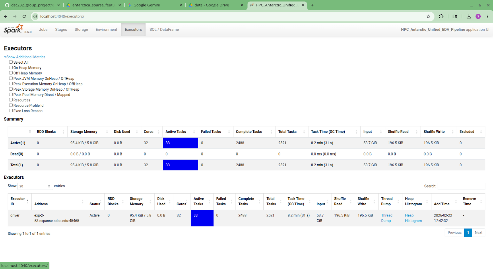

# Milestone 2


## __Antarctica's Digital Twin: Exploratory Data Analysis (EDA)__

* This project explores a high-resolution, multimodal dataset fusing laser altimetry, gravity fields, ocean thermodynamics, and sub-glacial topography across the Antarctic continent (2019–2025)
* The goal is to provide a "physics-ready" feature space for machine learning models predicting ice sheet instability.

## Dataset
The dataset is the combination of 5 heterogeneous Antartic datasets:

| Dataset | What It Measures | Native Format | Resolution |
|---|---|---|---|
| **ICESat-2 ATL15** | Ice surface elevation change | NetCDF (HDF5 groups, 4 tiles) | 1 km |
| **GRACE/GRACE-FO** | Gravitational mass anomaly | NetCDF (lat/lon, 0.25°) | ~27 km |
| **Bedmap3** | Subsurface topography & ice thickness | NetCDF | 500 m |
| **GLORYS12V1** | Ocean temperature & salinity (4D) | NetCDF (lat/lon/depth/time) | 1/12° (~8 km) |
| **Master Grid** | Coordinate reference template | Created by pipeline | 500 m |

The unification of these datasets is reviewed below in "Preprocessing Plan" and described in detail [here](https://github.com/scotty-ucsd/dsc232_group_project/tree/Milestone2/pre_pre_processing_pipeline/docs/COMPREHENSIVE_EDA_AND_PREPROCESSING.md) (also linked below).


### GitHub Repository Setup
- GitHub IDs for Scotty Rogers and Hans Hanson: *scotty-ucsd* and *hanspeder*
- Public GitHub Repository for this project: https://github.com/scotty-ucsd/dsc232_group_project
    - Scotty Rogers and Hans Hanson are collaborators
- Links to data
    - Full dataset on SDSC and also available [here](https://drive.google.com/file/d/1SCAh3grsFHkzpx7UXMOyG7_7V2c_xyG0/view?usp=sharing)
    - Sample data can be accessed directly in this repo


### SDSC Expanse Environment Setup

#### Jupyter Session Details
* Account:
    ```
    TG-SEE260003
    ```
* Partition:
    ```
    shared
    ```
* Time limit (min): 45
    * To get statistics, create plots, generate sample subset for `antarctica_sparse_features.parquet` took ~ 26 minutes 
* Number of cores: 32
    * *note: see next section for more details*
* Memory required per node (GB): 128
    * *note: see next section for more details*
* Singularity Image File Location:
    ```
    ~/esolares/spark_py_latest_jupyter_dsc232r.sif
    ```
* Environment Modules to be loaded:
    ```
    singularitypro
    ```
* Working Directory:
    ```
    home
    ```
* Type:
    ```
    JupyterLab
    ```

#### SparkSession Configuration
* Configuration Details:
    ```python
    spark = (
        SparkSession.builder
        .appName("HPC_Antarctic_Unified_EDA_Pipeline")
        .config("spark.driver.memory",            driver_mem)
        .config("spark.executor.instances",        str(EXECUTOR_INSTANCES))
        .config("spark.executor.cores",            str(EXECUTOR_CORES))
        .config("spark.executor.memory",           exec_mem)
        .config("spark.sql.shuffle.partitions",    str(SHUFFLE_PARTITIONS))
        # --- Driver result budget ---
        .config("spark.driver.maxResultSize",      "4g")
        # --- Network stability for large scans ---
        .config("spark.network.timeout",           "1200s")
        # --- Parallel partition discovery for deep dirs ---
        .config("spark.sql.sources.parallelPartitionDiscovery.threshold", "32")
        .config("spark.sql.sources.parallelPartitionDiscovery.parallelism", "64")
        # --- Adaptive Query Execution ---
        .config("spark.sql.adaptive.enabled",                      "true")
        .config("spark.sql.adaptive.coalescePartitions.enabled",   "true")
        .config("spark.sql.adaptive.advisoryPartitionSizeInBytes", "128m")
        # --- Parquet pushdown & vectorisation ---
        .config("spark.sql.parquet.filterPushdown",                "true")
        .config("spark.sql.parquet.mergeSchema",                   "false")
        # --- Disk spill safety : use Lustre scratch, NOT /tmp ---
        .config("spark.local.dir",
                os.environ.get("TMPDIR",
                               os.path.join(os.getcwd(), "spark_scratch")))
        .getOrCreate()
    )
    ```
* Spark SDSC Resource Reasoning:
    * 1. Cores
        * Recall we selected 32 for the *Number of cores* in our SDSC setup
        * `spark.executor.instances` is `6` and `spark.executor.cores` is `5`, so this results in `30` cores being used for our executor and the remaining `2` cores left for our driver
    * 2. Memory
        * Recall we selected 128 GB for the *Memory required per node* in our SDSC setup
        * `spark.executor.memory` is `19` GB and we have a total of `6` `spark.executor.instances`, this results in using `114` GB
        * `spark.driver.memory` is set to `10` GB, so that brings the total up to `124` GB and leaves a safety buffer of `4`GB for the VM operating system.

Screenshot of Spark UI showing multiple executors active during data loading:



### Data Exploration using Spark
#### Spark methods
* `df.schema` was used to find column names and data types
* `df.count()` was used to find the number of rows
* `len(df.columns)` was used to find the number of columns
* `df.agg()` with SQL functions was used to find min,max,mean,standard deviation

#### EDA Results
How many observations does this dataset have?
* `antarctica_sparse_features.parquet` is a massive ~40GB compressed parquet file
    * Total Number of Columns: 28
    * Total Number of Rows: 1,386,866,499
    * Total Observations: 38,832,261,972

* Schema Details

| # | Column | Type | Dims | Description | Source |
|---|---|---|---|---|---|
| 1 | `y` | float64 | — | EPSG:3031 northing [m] | Coordinates |
| 2 | `x` | float64 | — | EPSG:3031 easting [m] | Coordinates |
| 3 | `exact_time` | timestamp | — | ICESat-2 observation timestamp | ICESat-2 |
| 4 | `month_idx` | int32 | — | Year×12+Month (partition key) | Derived |
| 5 | `mascon_id` | int32 | — | GRACE mascon identifier | GRACE/Master map |
| 6 | `surface` | float32 | — | Ice surface elevation [m] | Bedmap3 |
| 7 | `bed` | float32 | — | Bedrock elevation [m] | Bedmap3 |
| 8 | `thickness` | float32 | — | Ice thickness [m] | Bedmap3 |
| 9 | `bed_slope` | float32 | — | \|∇(bed)\| [m/m] | Spatial features |
| 10 | `dist_to_grounding_line` | float32 | — | Distance to grounding line [m] | Spatial features |
| 11 | `clamped_depth` | float32 | — | Draft depth clamped to ocean floor [m] | Ocean |
| 12 | `dist_to_ocean` | float32 | — | Distance to nearest ocean pixel [m] | Ocean |
| 13 | `ice_draft` | float32 | — | Ice base depth below sea level [m] | Ocean |
| 14 | `delta_h` | float32 | t | Elevation anomaly [m] | ICESat-2 |
| 15 | `ice_area` | float32 | t | Fractional ice coverage | ICESat-2 |
| 16 | `surface_slope` | float32 | t | \|∇(h_dynamic)\| [m/m] | Spatial features |
| 17 | `h_surface_dynamic` | float32 | t | surface + delta_h [m] | Spatial features |
| 18 | `thetao_mo` | float32 | t | Monthly avg ocean temp [°C] | Ocean |
| 19 | `t_star_mo` | float32 | t | Monthly avg thermal driving [°C] | Ocean |
| 20 | `so_mo` | float32 | t | Monthly avg salinity [PSU] | Ocean |
| 21 | `t_f_mo` | float32 | t | Monthly avg freezing point [°C] | Ocean |
| 22 | `t_star_quarterly_avg` | float32 | t | 3-month rolling avg T* [°C] | Ocean |
| 23 | `t_star_quarterly_std` | float32 | t | 3-month rolling stddev T* | Ocean |
| 24 | `thetao_quarterly_avg` | float32 | t | 3-month rolling avg θ [°C] | Ocean |
| 25 | `thetao_quarterly_std` | float32 | t | 3-month rolling stddev θ | Ocean |
| 26 | `lwe_mo` | float32 | t | Monthly GRACE LWE [m] | GRACE |
| 27 | `lwe_quarterly_avg` | float32 | t | 3-month rolling avg LWE [m] | GRACE |
| 28 | `lwe_quarterly_std` | float32 | t | 3-month rolling stddev LWE | GRACE |
| 29 | `lwe_fused` | float32 | t | ABS-weighted pixel-level mass [m] | Fusion |
| 30 | `month_idx` | int32 | — | Partition key (Year×12+Month) | Derived |

> **Key**: "t" in the Dims column indicates the column varies with time (per ICESat-2 observation epoch).


#### Data Plots


* We're going to investigate this upward trend a bit more, since it may seem counter-intuitive at first glance.  It may be that increased melting in the Antarctic is resulting in greater changes in ice thickness, even if mean ice thickness is decreasing (see graph below).


### Preprocessing Plan

- We realize that we are supposed to describe our plan for, not perform, preprocessing here, but a significant amount of "pre-pre-processing" was required to fuse the above datasets.  As mentioned in our project abstract, one of our group members, Scotty Rogers, is familiar and works professionally with satellite data at Los Alamos National Laboratory.  Motivated by his own interest in the Antarctic-related satellite data, he fused the above datasets to create a unified one suitable for this project.  This was a major effort in itself and required numerous pre-processessing steps, such as reconciling the differing spatial resolutions between the datasets (500m, 1km, 8km, and 27km) as well as two different coordinate systems, EPSG: 4326 (geographic) and EPSG:3031 (Antarctic Polar Stereographic).

* A detailed explanation and summary of this "pre-pre-processing pipeline" can be found [here](https://github.com/scotty-ucsd/dsc232_group_project/tree/Milestone2/pre_pre_processing_pipeline/docs/COMPREHENSIVE_EDA_AND_PREPROCESSING.md).


- How we plan to handle missing values
    - This dataset is large enough that we can afford to drop missing values rather than impute them
    - In some cases, 

- How we will handle data imbalance (if applicable)
    * maybe 

- Transformations to apply (scaling, encoding, feature engineering)
    * `exact_time` will be scaled 0 to 1 using `df.withColumn` and SQL functions
    * `lwe` columns will be converted to meters from cm and mm

- Spark operations to be used


### Jupyter Notebook Links

[Notebook for SDSC](/eda_sdsc/sdsc_eda.ipynb)

[Additional EDA on SDSC](/eda_sdsc/bonus_eda_plots.ipynb)

[Notebook for sample data](EDA_local_sample_data.ipynb)

