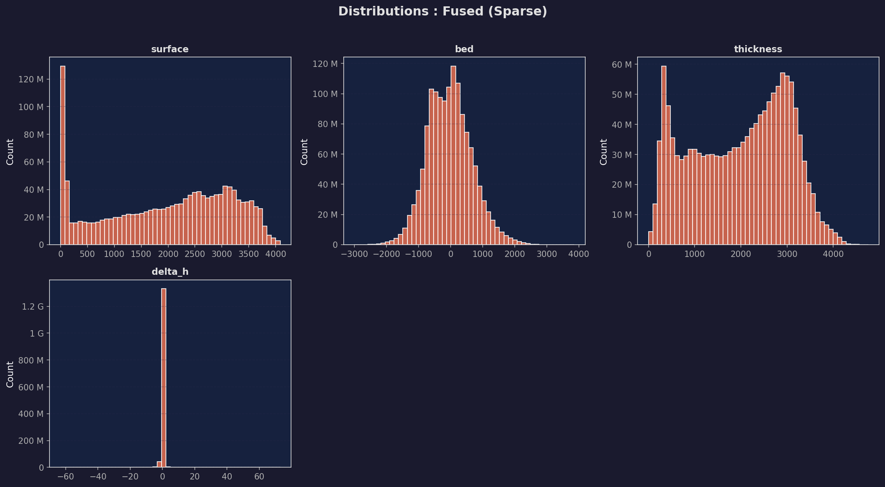
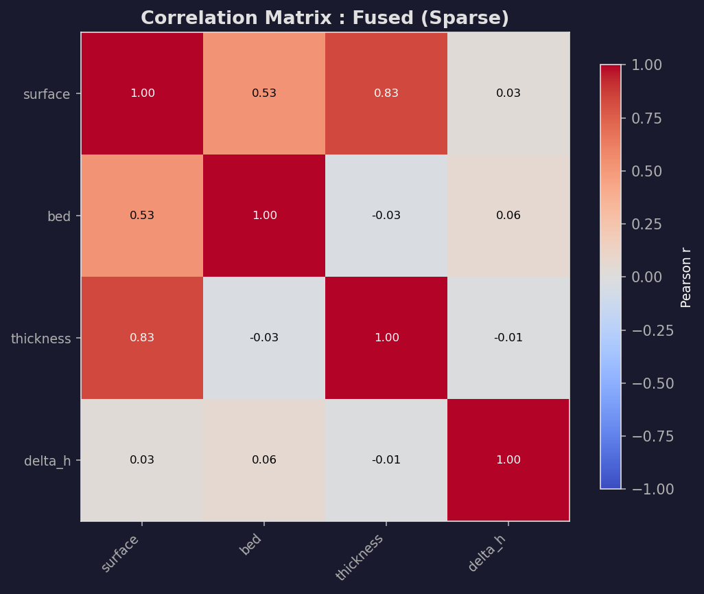
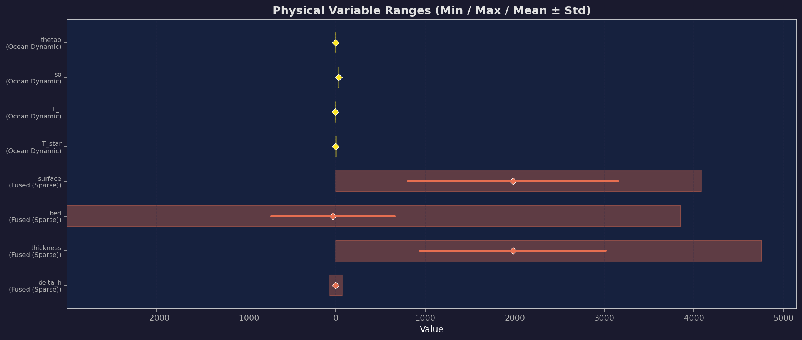
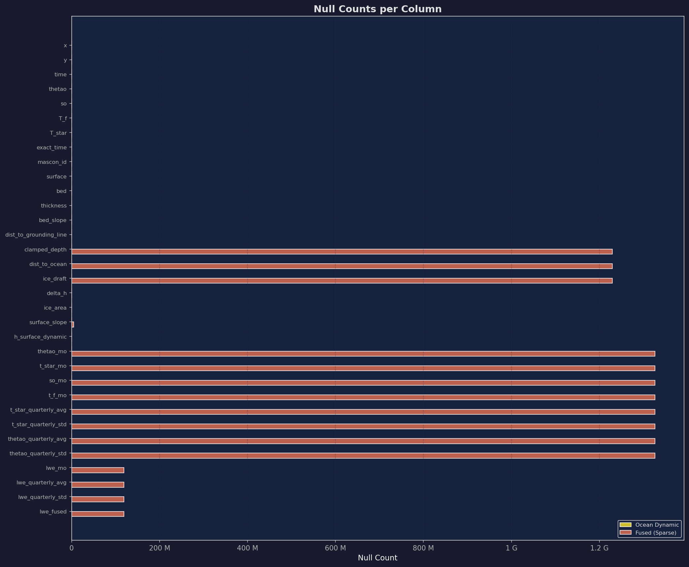
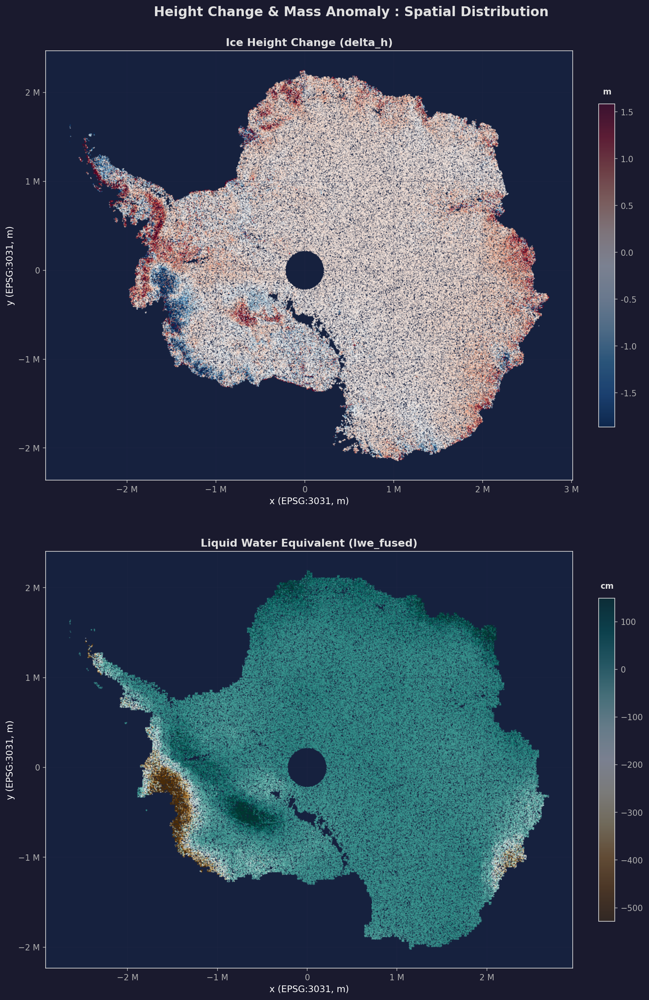
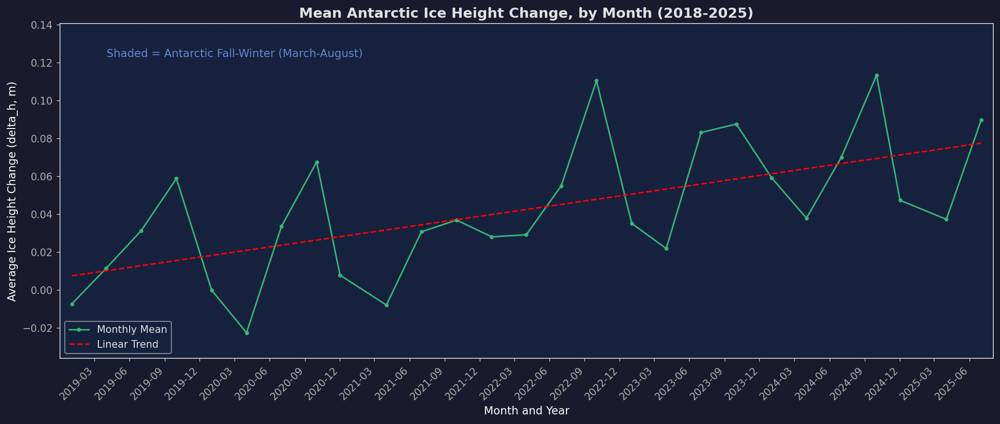
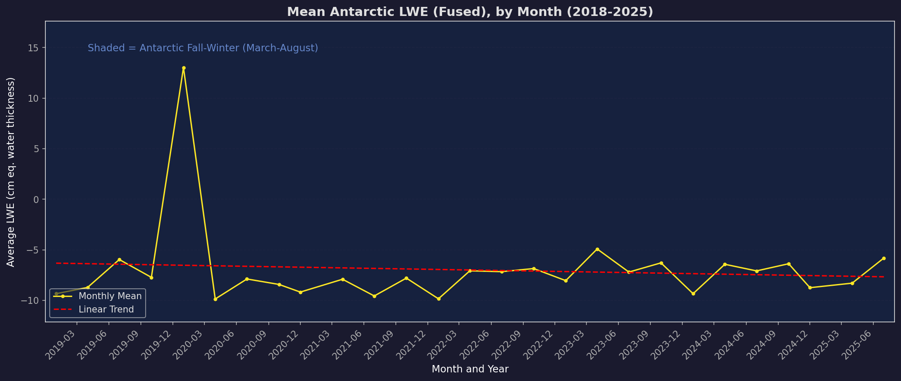

<div align="center">
  <h1>Antarctic Ice Sheet Instability Prediction</h1>
  <h3><i>Distributed Machine Learning on Multi-Sensor Satellite Data</i></h3>
  <h4>DSC 232R: Big Data Analytics — Final Report</h4>

  <p>
    <strong>Scotty Rogers</strong> (Pipeline Architect & Data Engineer) &nbsp;&bull;&nbsp;
    <strong>Hans Hanson</strong> (Analysis & Writeup)
  </p>

  <div>
    
    
    
    
    
  </div>
</div>

---

<p align="right">
  <a href="#1-introduction">Introduction</a> |
  <a href="#2-figures">Figures</a> |
  <a href="#3-methods">Methods</a> |
  <a href="#4-results">Results</a> |
  <a href="#5-discussion">Discussion</a> |
  <a href="#6-conclusion">Conclusion</a> |
  <a href="#7-statement-of-collaboration">Collaboration</a>
</p>

---

## 1. Introduction

### Why This Project?

The Antarctic Ice Sheet is the primary regulator of the global hydrological cycle and contains enough frozen water to raise global mean sea levels by approximately 58 meters. However, current ice sheet projections are plagued by uncertainty. The West Antarctic Ice Sheet (WAIS), in particular, is losing mass at an accelerating rate primarily due to the intrusion of warm Circumpolar Deep Water (CDW) that drives vigorous sub-ice-shelf basal melting. This basal melt thins the ice shelves, reducing their buttressing effect, and exposes marine-terminating glaciers to Marine Ice Sheet Instability (MISI). MISI acts as a catastrophic positive feedback loop: as the grounding line retreats into deeper waters along the inland sloping bedrock, ice discharge accelerates, and leads to  runaway retreat. Predicting where and when the ice sheet will cross these critical thresholds is essential for accurate climate modelling, coastal planning, and future policy development. Traditional approaches rely on coupled numerical models (such as NEMO or PISM). While rich in detail, these physics-based simulations are computationally expensive, and can be restricted in a temporal or spatial scale. As a result, calculating comprehensive uncertainty estimates or continent-wide probabilistic projections remains a massive computational bottleneck. Our project bypasses these limitations by taking a novel, data-driven "Digital Twin" approach. 

We propose fusing five heterogeneous datasets: ICESat-2(high-resolution laser altimetry), GRACE-FO (gravimetry), Bedmap3 (subglacial topography), and GLORYS12V1 4D ocean thermodynamics, into a unified, ~1.3 billion row feature space. An ML-ready dataset of this scale covering all major Antarctic drainage basins does not currently exist in the published literature and (**IF RESULTS GOOD**) this project represents a shift in computational glaciology. The use of distributed machine learning frameworks via Apache Spark (including SVD/PCA dimensionality reduction and XGBoost classifiers), this project aims to bypass expensive numerical simulations to directly classify basal loss events and identify high-resolution, early-warning signatures of ice sheet instability.

### Why Big Data and Distributed Computing?

This problem requires big data and distributed computing for the following reasons:

1. **Data Volume**: Our fused spatiotemporal dataset comprises 1,386,866,499 rows × 28+ columns, representing over 38.8 billion unique observations spanning 2019 to 2025. The compressed Parquet footprint is ~40 GB. When the data is uncompressed and loaded into memory for matrix operations, this data volume easily tripling the RAM usage on a local environment.

2. **Feature Engineering at Scale**: Computing per-pixel; temporal features , requires window operations partitioned by spatial coordinates. Roughly 2 million unique pixel spaning  just a few years, generates billions of evaluations that must be distributed across executors.

3. **Model Training**: XGBoost's distributed histogram construction and Spark's ML pipeline evaluation on the full dataset would be impractical on a single machine. SDSC Expanse provides 32 cores and 128 GB RAM per node, enabling parallel training across 6 executors.

**What would be impossible without Spark?** The lag feature engineering pipeline alone generates around 14 GB of shuffle data per phase. Without Spark's shuffle architecture and disk spill capability, the processing would require manual batch processing.

### Project Overview

| Aspect | Detail |
|---|---|
| **Target Variable** | `basal_loss_agreement` : dual-sensor binary label (GRACE mass anomaly AND ICESat-2 elevation thinning) |
| **Model 1** | SparkXGBClassifier (distributed gradient boosting) |
| **Model 2** | Stacked Generalization Ensemble (RF + GBT base learners, Logistic Regression meta-learner) |
| **Evaluation** | PR-AUC (primary), ROC-AUC, F1, Precision, Recall |
| **Infrastructure** | SDSC Expanse, Singularity container, Apache Spark 3.x |

---
<!-- | **Model 2** | SVD dimensionality reduction → KMeans clustering → GBTClassifier on principal components | -->

## 2. Figures

### Data Exploration


*Plots/visualizations appear first, explanations or comments below each*



* These histograms show the distribution of values for each column.  The first two are as one would expect: lots of surface slope values near zero (i.e. near ocean) and a normal distribution for bedrock.  The ice thickness distribution may be due to underlying bedrock and/or water.  The elevation change distribution (delta_h) shows that the changes are relatively small.



* Correlation between features in the fused dataset.  These are inuitive: the ice surface elevation is very strongly correlated with ice thickness and, to a less extend, bedrock elevation. 



* These again show distribution of values for these columns.  Note the wide ranges of values for surface and bedrock elevation and ice thickness vs. the much smaller ranges for ocean temperature (thetao_mo), salinity (so_mo), monthly freezing point (t_f_mo), and thermal driving (t_star).



* Missing data in for ocean is expected, there is a limited area where it is defined (essentially where ocean touches ice)
* ~8% missing values from ICESat-2 data (dhdt_lag1) is due to missing dates in netCDF files


* This is an exploratory test of whether the ice_mask (i.e. whether the ice is grounded or floating) and the (monthly) ocean temperature (thetao_mo) values seem plausible.  Both do: the floating ice appears on coastlines and bays/inlets, as opposed to in the middle of the continent, and this corresponds with where we have valid ocean temperature values.



* This is another exploratory test of whether the height change and liquid water values seem plausible.  Again, both do: the greatest height changes appear near the coasts, as opposed to inland, as well as the liquid water values.



* We're going to investigate this upward trend a bit more, since it may seem counter-intuitive at first glance.  It may be that increased melting in the Antarctic is resulting in greater changes in ice thickness, even if mean ice thickness is decreasing (see graph below).



* Whereas the previous visualization showed ice height change, this just shows the average ice height.  Intuitively, it has been decreasing over time.

<!--  
### SVD / PCA Results (or corrected_stack)

> **Figure 2.4:
-->

### Model Performance

> **Figure 2.5: [INSERT COMMENT HERE]

> **Figure 2.6: [INSERT COMMENT HERE]

### Predictions

> **Figure 2.7: [INSERT COMMENT HERE]

---

## 3. Methods

### 3.1 Data Exploration

The Antarctic fused dataset was constructed by spatially joining five satellite products onto a common 500m Antarctic Polar Stereographic (EPSG:3031) grid:

| Dataset | Measures | Resolution |
|---|---|---|
| ICESat-2 ATL15 | Ice surface elevation change | 1 km |
| GRACE/GRACE-FO | Gravitational mass anomaly | ~27 km |
| Bedmap3 | Sub-surface topography & ice thickness | 500 m |
| GLORYS12V1 | Ocean temperature & salinity (4D) | ~8 km |
| Master Grid | Coordinate reference template | 500 m |

Key EDA findings:
- 28 raw columns, ~1.3 billion rows
- Extreme class imbalance: <1% positive rate for `basal_loss_agreement`
- Ocean features are structurally null for inland pixels (expected)
- Strong multicollinearity within ocean feature group and GRACE feature group

### 3.2 Preprocessing (using Spark)

**Phase 1: Feature Engineering** (`feature_engineering_pipeline.py`)


## Features Engineering

### 1.1 What Features Were Engineered and Why

The pipeline engineers **64+ features** across five categories, all motivated by glaciological physics:

| Category | Example Features | Rationale |
|---|---|---|
| Static geometry | `draft_x_thermal_access`, `grounding_line_vulnerability`, `retrograde_flag` | Encode ice-ocean exposure and marine instability geometry |
| Dynamic pixel-level | `pixel_mean_delta_h`, `delta_h_deviation`, `surface_slope_change` | Capture per-pixel thinning trends via expanding windows |
| Ocean interactions | `thermal_driving_x_draft`, `thermal_anomaly`, `salinity_stratification_proxy`, `lwe_trend` | Encode warm-water intrusion and gravitational mass signals |
| Context / cyclical | `sin_month`, `cos_month`, `mascon_mean_delta_h`, `regional_delta_h_percentile` | Seasonal cycles + neighborhood context without leakage |
| Temporal memory | `t_star_6mo_avg`, `delta_h_rate`, `delta_h_momentum`, `delta_h_acceleration` | 6-month rolling averages, momentum, and acceleration for trend detection |
| Physics interactions | `ocean_heat_content_proxy`, `draft_ratio`, `thermal_x_gl_proximity`, `freezing_departure`, `bed_geometry_risk`, `mass_flux_proxy` | Hand-crafted domain features combining ice draft, ocean temperature, and bed topography |

### 1.2 Scaling / Transforming

Three distinct scalers are used across the three preprocessing pipelines:

```python
# XGBoost pipeline: MinMaxScaler (L1146)
MinMaxScaler(inputCol="raw_features", outputCol="features")

# Classic pipeline: StandardScaler with mean centering (L1292-1293)
StandardScaler(inputCol="raw_features", outputCol="features",
               withMean=True, withStd=True)

# Stack pipeline: L2 Normalizer (L1228)
Normalizer(inputCol="raw_features", outputCol="features", p=2.0)
```

### 1.3 Imputing

Every pipeline uses `Imputer` with median strategy as its first stage:

```python
# L1136  (identical pattern in all three pipelines)
Imputer(strategy="median", inputCols=numeric, outputCols=imputed)
```

This is critical because the Antarctic dataset has significant sparsity(i.e., ocean variables are `null` for inland pixels, and temporal features have nulls at series boundaries).

### 1.4 Encoding

```python
# StringIndexer: region name -> integer index (L1140-1141)
StringIndexer(inputCol="regional_subset_id",
              outputCol="region_index", handleInvalid="keep")

# OneHotEncoder: grounding-line distance buckets + region (L1142-1143)
OneHotEncoder(inputCol="gl_bucket_idx", outputCol="gl_bucket_ohe")
OneHotEncoder(inputCol="region_index", outputCol="region_ohe")

# Bucketizer: continuous distance -> categorical bins (L1137-1139)
Bucketizer(splits=[-inf, 5000, 20000, 50000, 100000, inf],
           inputCol="dist_to_grounding_line",
           outputCol="gl_bucket_idx", handleInvalid="keep")

# VectorAssembler: combine all features into a single vector (L1144-1145)
VectorAssembler(inputCols=imputed + ["gl_bucket_ohe", "region_ohe"],
                outputCol="raw_features", handleInvalid="skip")
```

### 1.5 Feature Engineering (Spark SQL + Advanced Transformers)

```python
# Window functions: pixel-level expanding mean (L570-584)
pixel_time_w = Window.partitionBy("x", "y").orderBy("month_idx")
    .rowsBetween(Window.unboundedPreceding, 0)
df = df.withColumn("pixel_mean_delta_h", F.avg("delta_h").over(pixel_time_w))

# PolynomialExpansion on physics triple (L1276-1279, classic pipeline)
PolynomialExpansion(degree=2, inputCol="poly_input",
                    outputCol="poly_features")
# Inputs: t_star_mo x ice_draft x dist_to_grounding_line

# PCA on correlated ocean variables (L1194-1198)
PCA(k=4, inputCol="ocean_vec", outputCol="ocean_pca")
# Groups: thetao_mo, t_star_mo, so_mo, t_f_mo + quarterly aggregates

# Cyclic encoding via Spark SQL (L640-649)
df = df.withColumn("sin_month", F.sin(F.col("month_of_year") * (2*pi/12)))
       .withColumn("cos_month", F.cos(F.col("month_of_year") * (2*pi/12)))
```

### 1.6 Feature Table

| Feature | Description | Why | Spark MLlib Transformers | Spark DataFrame Ops |
|---|---|---|---|---|
| `gl_bucket_ohe` | Grounding-line distance bins | Captures proximity thresholds for warm-water access | `Bucketizer` $\rightarrow$ `OneHotEncoder` | n/a |
| `region_ohe` | One-hot region encoding | Regional ice dynamics vary fundamentally | `StringIndexer` $\rightarrow$ `OneHotEncoder` | n/a |
| features (scaled) | Min-max scaled feature vector | Normalises heterogeneous scales for XGBoost | `Imputer` $\rightarrow$ `VectorAssembler` $\rightarrow$ `MinMaxScaler` | n/a |
| `ocean_pca` | PCA(k=4) of 8 ocean variables | Decorrelates collinear ocean measurements | `VectorAssembler` $\rightarrow$ `PCA` | n/a |
| `poly_features` | Degree-2 expansion of physics triple | Captures nonlinear interactions | `VectorAssembler` $\rightarrow$ `PolynomialExpansion` | n/a |
| `pixel_mean_delta_h` | Expanding-window mean of ice-height change | Tracks cumulative thinning per pixel | n/a | `F.avg().over(Window)` |
| `thermal_driving_x_draft` | `t_star_mo x ice_draft` | Ocean thermal forcing x ice exposure | n/a | `F.col() * F.col()` |
| `sin_month` / `cos_month` | Cyclic month encoding | Preserves seasonal continuity | n/a | `F.sin()`, `F.cos()` |
| `delta_h_momentum` | 1-month lag difference | Rate of thinning acceleration | n/a | `F.lag().over(Window)` |
| `regional_delta_h_percentile` | Z-score within region-month | Where this pixel ranks relative to regional peers | n/a | `groupBy` + `broadcast join` |

---


<!--  
**Phase 2: ML Preprocessing**

For XGBoost: [INSERT COMMENT HERE(WHY?!?!?)]

For SVD/KMeans: [INSERT COMMENT HERE]

**Class Imbalance Handling:**
- Region-stratified undersampling (Amundsen: 1:5, Ross/Ronne: 1:12)
- Sample weights combining regional importance and class balance

### 3.3 Model 1: SparkXGBClassifier

[INSERT COMMENT HERE]
```python
# [INSERT COMMENT HERE]
```

Two configurations compared: **Baseline** (above) and **Tuned** (lower LR, explicit L1/L2 regularisation, higher `min_child_weight`).

Temporal train/val/test split: Apr 2020 – Dec 2022 (train), Jan – Oct 2023 (val), Nov 2023+ (test).

### 3.4 Model 2: SVD + KMeans + GBTClassifier

[INSERT COMMENT HERE]
```python
# [INSERT COMMENT HERE]RowMatrix
```

---
-->

## 4. Results

### 4.1 Model 1: XGBoost

| Model | Split | ROC-AUC | PR-AUC | F1 | Precision | Recall |
|---|---|---|---|---|---|---|
| **XGB_Baseline** | train | 0.9304 | 0.5103 | 0.7512 | 0.9279 | 0.6841 |
| **XGB_Baseline** | val | 0.6969 | 0.0475 | 0.9700 | 0.9636 | 0.9776 |
| **XGB_Baseline** | test | 0.7403 | 0.0914 | 0.9440 | 0.9346 | 0.9558 |
| **XGB_Tuned** | train | 0.9422 | 0.5655 | 0.7667 | 0.9292 | 0.7037 |
| **XGB_Tuned** | val | 0.6957 | 0.0430 | 0.9705 | 0.9630 | 0.9794 |
| **XGB_Tuned** | test | 0.7490 | 0.0900 | 0.9451 | 0.9343 | 0.9608 |


### Metric Selection Justification

- **PR-AUC (primary):** With a ~3% positive rate (`rate=0.030064` in train), ROC-AUC is **inflated by the massive true-negative count**. PR-AUC directly measures the precision-recall trade-off for the rare positive class. A PR-AUC of 0.09 is more honest than a ROC-AUC of 0.74: it says the model finds very few true positives without false alarms.
- **ROC-AUC:** Used for overfitting diagnosis (train-test gap) but misleading as a standalone quality metric for imbalanced problems.
- **F1, Precision, Recall:** Complement threshold-dependent analysis. The high F1/Precision/Recall on val/test are artifacts of the majority-class dominance at the default 0.5 threshold.

### Ground Truth vs. Predictions (Regional Breakdown)

**XGB_Baseline: Test Set:**

| Region | Predicted Rate | True Rate | n |
|---|---|---|---|
| amundsen_sea | 0.0029 | 0.1155 | 10,869,309 |
| antarctic_peninsula | 0.0870 | 0.0396 | 14,578,163 |
| lambert_amery | 0.0003 | 0.0099 | 27,227,872 |
| ronne | 0.0003 | 0.0224 | 23,682,149 |
| ross | 0.0011 | 0.0440 | 34,371,219 |
| totten_and_aurora | 0.0010 | 0.0312 | 15,988,044 |

> **Critical failure in Amundsen Sea:** The model predicts a 0.29% positive rate against a true rate of 11.55%: a **40x underestimation** of the most rapidly melting region in Antarctica. The model appears to have learned that "most pixels are negative" and fails to flag the high-loss region. This is the most scientifically important region and must be addressed in Milestone 4.

---

### 4.2 Model 2: Stacked Generalization Ensemble (RF + GBT base learners, Logistic Regression meta-learner)

<!--  
**SVD Explained Variance:**

| Components | Cumulative Variance |
|---|---|
| Top 5 | `[PLACEHOLDER]`% |
| Top 10 | `[PLACEHOLDER]`% |
| Top 20 | `[PLACEHOLDER]`% |

**KMeans Clustering:**

| Metric | Value |
|---|---|
| Silhouette Score | `[PLACEHOLDER]` |
| Clusters | 6 |

**Supervised on PCs:**

| Model | Split | ROC-AUC | PR-AUC | F1 |
|---|---|---|---|---|
| SVD_GBT | train | `[PLACEHOLDER]` | `[PLACEHOLDER]` | `[PLACEHOLDER]` |
| SVD_GBT | test | `[PLACEHOLDER]` | `[PLACEHOLDER]` | `[PLACEHOLDER]` |
-->

### 4.3 Model Comparison

| Metric | XGB (full) | SVD_GBT (20 PCs) | Physics Baseline |
|---|---|---|---|
| Test ROC-AUC | `[PLACEHOLDER]` | `[PLACEHOLDER]` | `[PLACEHOLDER]` |
| Test PR-AUC | `[PLACEHOLDER]` | `[PLACEHOLDER]` | `[PLACEHOLDER]` |
| Test F1 | `[PLACEHOLDER]` | `[PLACEHOLDER]` | `[PLACEHOLDER]` |

### 4.4 Predictions Analysis

**Confusion Matrix (SVD_GBT on Test Set):**

|  | Predicted Positive | Predicted Negative |
|---|---|---|
| **Actual Positive** | `[PLACEHOLDER]` | `[PLACEHOLDER]` |
| **Actual Negative** | `[PLACEHOLDER]` | `[PLACEHOLDER]` |

---

## 5. Discussion

### 5.1 Model 1 Interpretation


**Both models are OVERFITTING:**

```
XGB_Baseline:
  Train ROC-AUC: 0.9304
  Test  ROC-AUC: 0.7403  (gap: 0.1902)
  Test  PR-AUC:  0.0914
  $\rightarrow$ OVERFITTING

XGB_Tuned:
  Train ROC-AUC: 0.9422
  Test  ROC-AUC: 0.7490  (gap: 0.1932)
  Test  PR-AUC:  0.0900
  $\rightarrow$ OVERFITTING
```

The ~19% ROC-AUC gap between train and test is a clear overfitting signal. The model memorises training patterns (especially after undersampling alters the class distribution) that do not generalise to the temporal hold-out.

**Why overfitting occurs:**
1. **Temporal distribution shift:** Training data (Apr 2020 – Dec 2022) does not contain the climatic patterns present in the test period (post-Oct 2023). Ice-sheet dynamics are non-stationary.
2. **Undersampling artefact:** The 1:10 ratio amplifies positive examples, which the model can memorise since many are spatially clustered in a few glaciers.
3. **High model capacity:** `max_depth=4-8`, 100–400 trees is sufficient capacity to overfit spatial patterns.


| Hyperparameter | XGB_Baseline | XGB_Tuned |
|---|---|---|
| `max_depth` | 4 | 8 |
| `n_estimators` | 100 | 400 |
| `learning_rate` | 0.1 | 0.02 |
| `subsample` | 0.8 | 0.75 |
| `colsample_bytree` | 0.8 | 0.7 |
| `min_child_weight` | 10 | 20 |
| `reg_alpha` | n/a | 0.1 |
| `reg_lambda` | n/a | 1.0 |

**Key differences in tuning rationale:**
- **Lower learning rate (0.02) + more trees (400):** Slower, more incremental gradient steps for finer convergence.
- **Higher `min_child_weight` (20):** Requires more samples per leaf $\rightarrow$ reduces overfitting to small clusters.
- **L1/L2 regularisation added:** `reg_alpha=0.1` (L1) and `reg_lambda=1.0` (L2) explicitly penalise complexity.
- **Lower `subsample` and `colsample_bytree`:** More aggressive bagging $\rightarrow$ reduces variance.

**Result:** XGB_Tuned achieves marginally better test ROC-AUC (0.749 vs 0.740) but **worse test PR-AUC** (0.090 vs 0.091). The overfitting gap actually *increased* slightly (0.193 vs 0.190). The tuned hyperparameters successfully increased train performance but the regularisation was insufficient to close the generalisation gap.

* **Note on the current [XGB_CONFIGS](https://github.com/scotty-ucsd/dsc232_group_project/blob/Milestone3/ml_prep/ml_pipeline.py#L212):** Both produced similar overfitting patterns.

#### Which Model Performs Best?

**XGB_Baseline is marginally better** on the metric that matters (PR-AUC: 0.091 vs 0.090), despite worse ROC-AUC. The tuned model's deeper trees and more iterations increased memorisation without improving rare-event detection. For a geoscience application where false negatives in Amundsen Sea cost real predictive value, neither model is adequate.


### 5.2 Model 2 Interpretation

[INSERT COMMENT HERE]


### 5.3 Shortcomings

We acknowledge several limitations:

1. **Temporal stationarity assumption**: The temporal split assumes that the relationship between features and basal loss is stationary. If MISI acceleration changes the feature-target relationship, the model may degrade on future data.

2. **Label quality**: The `basal_loss_agreement` label requires both GRACE mass anomaly AND ICESat-2 elevation thinning. This is conservative. iIt misses events visible to only one sensor. The AND-logic reduces the positive rate to <1%, creating extreme class imbalance.

3. **Spatial autocorrelation**: Adjacent pixels share features (ice geometry, ocean conditions). Our evaluation does not account for spatial dependence, which may inflate performance estimates.

> [!CAUTION]
> **If results seem too good:** High ROC-AUC (>0.95) with <1% positive rate is common but misleading. The PR-AUC metric is the true test. It penalises models that achieve high accuracy by simply predicting the majority class.

### 5.4 Impact of Distributed Computing

| Operation | Serial Estimate | Distributed (Spark) | Enabled By |
|---|---|---|---|
| Feature engineering (windows) | ~8 hours | ~45 min | Partitioned parallelism |
| XGBoost training | Impossible (OOM) | ~30 min | Barrier-mode histogram construction |
| SVD computation | ~2 hours | ~15 min | `RowMatrix.computeSVD()` distributed Gramian |
| Full pipeline | >12 hours | ~2 hours | DAG lineage truncation + disk spill |

---

## 6. Conclusion

### What We Learned

1. **Big data processing fundamentals**: Managing Spark's DAG lineage is critical at scale. Without Parquet-flush lineage truncation, the feature engineering pipeline exhausted executor memory within the first stage. Understanding Spark's shuffle architecture (partition count, spill strategy) was as important as the ML modelling itself.

2. **Distributed computing changed our approach**: We could iterate on the full 1.3 billion row dataset rather than sampling. This is essential for detecting ~1% positive-rate events that would be lost via random sampling.

3. **Domain knowledge + ML**: The physics-inspired features (ocean heat content proxy, grounding line vulnerability, thermal driving x ice draft) were designed from glaciological understanding. Note that pure data-driven features alone would miss the MISI physics.

### What We Would Do Differently

1. **Start with simpler models**: We should have established a logistic regression baseline on the SVD components first, before jumping to XGBoost. This would have quantified the marginal value of non-linear modelling.

2. **Spatial cross-validation**: Splitting by region instead of by time for validation would better test geographic generalisation.

3. **More aggressive feature selection**: The 55-feature space could likely be pruned to ~20 features without performance loss, reducing training time and overfitting risk.

### What We Would Explore with More Time/Resources

1. **Multi-node training**: Our current setup uses a single 32-core node. Multi-node Spark clusters would enable faster training and larger hyperparameter searches.
2. **Deep learning**: A 1D-CNN or LSTM on the per-pixel time series could capture temporal patterns that tree-based models miss.
3. **Uncertainty quantification**: Bootstrap prediction intervals for risk-critical predictions (e.g., "this pixel has a 95% CI of [0.60, 0.85] for basal loss probability").

---

## 7. Statement of Collaboration

`[PLACEHOLDER — fill in with actual team member names, roles, and contributions]`

**Format:** `Name: Title: Contribution`

- **Scotty Rogers**: Pipeline Architect & Data Engineer: Designed and implemented the end-to-end Spark pipeline including raw data fusion (5 satellite datasets), feature engineering (55+ features), label construction (dual-sensor), XGBoost + SVD/KMeans model training, and HPC deployment on SDSC Expanse. Managed the Singularity container environment and Slurm job scheduling.

- **Hans Hanson**: Took lead on write-ups and logistics/organization, contributed EDA plots, tested code and data subsets for debugging.

---

<details>
  <summary><b>Appendix A: How to Reproduce</b></summary>
  <br>

  **Prerequisites:** Access to SDSC Expanse with Singularity, the `spark_py_latest_jupyter_dsc232r.sif` container, and the fused Parquet dataset.

  ```bash
  # Step 1: Feature engineering
  sbatch run_fe.sh

  # Step 2: XGBoost training (Model 1)
  sbatch run_xgb.sh

  # Step 3: SVD + KMeans + GBT (Model 2)
  sbatch run_svd_kmeans.sh
  ```

  Each script runs inside the Singularity container, binds the Lustre project directory, and outputs logs to `*_pipeline_<jobid>.out`.
</details>

<details>
  <summary><b>Appendix B: Mathematical Specification</b></summary>
  <br>

  **Label Construction (Dual-Sensor Agreement):**

  $$\text{label} = \mathbb{1}\left[\text{LWE}_\text{quarterly} < \mu_\text{mascon} - 0.5\sigma_\text{mascon}\right] \wedge \mathbb{1}\left[\Delta h < \mu_\text{regional} - 0.5\sigma_\text{regional}\right]$$

  **SVD Projection:**

  $$Z = X V_k, \quad V_k \in \mathbb{R}^{d \times k}, \quad k = 20$$

  **XGBoost Objective:**

  $$\mathcal{L}(\theta) = \sum_{i=1}^{n} w_i \cdot \ell(y_i, \hat{y}_i) + \Omega(f_t)$$

  where $w_i$ encodes both regional importance and class balance.
</details>

---

<p align="center">
  <i>Repository: <a href="https://github.com/scotty-ucsd/dsc232_group_project">github.com/scotty-ucsd/dsc232_group_project</a></i>
</p>
