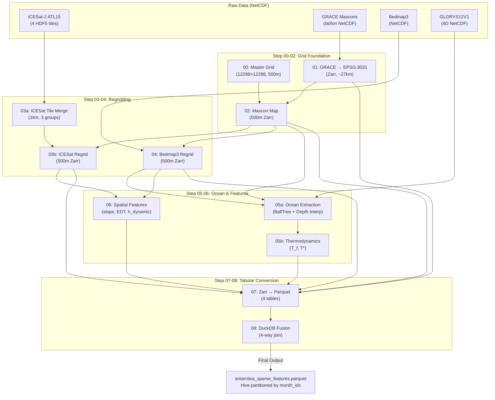

# Comprehensive EDA & Pre-Processing Summary

## Antarctica Digital Twin — Pre-Pre-Processing Pipeline

> **Project Context**: Graduate-level Big Data / Apache Spark course (DSC 232R) at UC San Diego.
> **Compute Target**: San Diego Supercomputer Center (SDSC) — PySpark cluster.
> **This Pipeline**: Runs **locally** on a 55–64 GB workstation to prepare raw geospatial data for PySpark ingestion.

---

## Table of Contents

1. [Project Goal](#1-project-goal)
2. [Why "Pre-Pre-Processing"?](#2-why-pre-pre-processing)
3. [Pipeline Architecture](#3-pipeline-architecture)
4. [Data Sources](#4-data-sources)
5. [Step-by-Step Summary](#5-step-by-step-summary)
6. [Final Feature Store Schema](#6-final-feature-store-schema)
7. [Data Exploration (EDA)](#7-data-exploration-eda)
8. [Data Transformations & Normalisation](#8-data-transformations--normalisation)
9. [Plotting Code for Visualisation](#9-plotting-code-for-visualisation)
10. [Future PySpark Integration](#10-future-pyspark-integration)

---

## 1. Project Goal

Build a machine-learning-ready feature store that fuses **five heterogeneous Antarctic datasets** into a single tabular format (Parquet) suitable for distributed ML on SDSC:

| Dataset | What It Measures | Native Format | Resolution |
|---|---|---|---|
| **ICESat-2 ATL15** | Ice surface elevation change | NetCDF (HDF5 groups, 4 tiles) | 1 km |
| **GRACE/GRACE-FO** | Gravitational mass anomaly | NetCDF (lat/lon, 0.25°) | ~27 km |
| **Bedmap3** | Subsurface topography & ice thickness | NetCDF | ~1 km |
| **GLORYS12V1** | Ocean temperature & salinity (4D) | NetCDF (lat/lon/depth/time) | 1/12° (~8 km) |
| **Master Grid** | Coordinate reference template | Created by pipeline | 500 m |

The final product is an **ICESat-2-anchored sparse feature store** with ~30 columns and millions of rows per monthly partition, Hive-partitioned by `month_idx` for PySpark predicate pushdown.

---

## 2. Why "Pre-Pre-Processing"?

### The Core Problem

PySpark is designed for **flat, tabular data** (rows × columns). The raw Antarctic datasets are:

- **N-dimensional**: 3D cubes `(time, y, x)` and 4D arrays `(time, depth, lat, lon)`
- **Stored as NetCDF/HDF5**: PySpark has no native reader for NetCDF
- **In different coordinate systems**: EPSG:4326 (geographic) vs. EPSG:3031 (Antarctic Polar Stereographic)
- **At different spatial resolutions**: 500 m, 1 km, 8 km, 27 km
- **Requiring spatial operations**: CRS reprojection, raster resampling, BallTree lookups, distance transforms, gradient computation

### Why PySpark Cannot Handle These Operations

| Operation | Required By | Why PySpark Fails |
|---|---|---|
| **NetCDF/HDF5 I/O** | All raw data | No native reader. Would require UDFs wrapping xarray, loading entire files into driver memory |
| **CRS Reprojection** | GRACE, Ocean | No rasterio/rioxarray integration. Would need per-row pyproj UDFs — serialised, single-threaded |
| **Bilinear Interpolation** | ICESat-2, Bedmap3 | Requires 2D neighbourhood access. PySpark operates on independent rows — no concept of "adjacent pixel" |
| **BallTree Lookup** | Ocean extraction | Spatial index must fit in memory on one node. PySpark would serialise the tree per task |
| **Depth-Profile Interpolation** | Ocean extraction | 4D array indexing at arbitrary depth values — no SQL equivalent |
| **np.gradient** | Spatial features | Neighbourhood operation requiring chunk halos — no Spark equivalent |
| **EDT (Distance Transform)** | Grounding-line distance | Global operation — result at any pixel depends on ALL other pixels |

### Why Zarr Is the Bridge Format

**Zarr** serves as the intermediate n-dimensional format because:

1. **Parallel read/write**: Unlike NetCDF (HDF5), Zarr stores each chunk as an independent file — enabling concurrent reads without file-level locks.
2. **Dask integration**: Zarr + Dask enables lazy, out-of-core processing that respects memory limits.
3. **Regional writes**: Zarr supports `region=` writes, allowing block-by-block processing without loading the full array.
4. **Compression**: Blosc Zstd provides 3-5× compression with near-zero decompression overhead.

### Why Spatial Features Are Computed Before Tabular Conversion

Once data is flattened to Parquet (step_07), the **spatial topology is lost**. You cannot compute `np.gradient` on a tabular column — it requires knowing which row is "to the north". Computing spatial features (slope, distance transforms, dynamic elevation) while the data is still in array form is both correct and efficient.

---

## 3. Pipeline Architecture



---

## 4. Data Sources

### ICESat-2 ATL15 (v005)
- **What**: Ice-surface elevation anomalies relative to a reference DEM, plus rates of change (dh/dt) at 1-quarter and 4-quarter lags.
- **Coverage**: Four overlapping Antarctic tiles (A1–A4).
- **Temporal**: ~84 quarterly epochs (2018–2025).
- **Key Variables**: `delta_h`, `delta_h_sigma`, `dhdt`, `dhdt_sigma`, `ice_area`, `data_count`, `misfit_rms`.

### GRACE/GRACE-FO (CSR RL06.3)
- **What**: Gravitational mass anomaly expressed as Liquid Water Equivalent (LWE) thickness.
- **Coverage**: Global mascon grid, cropped to lat ≤ −50°.
- **Temporal**: Monthly, 2002–2025.
- **Key Variables**: `lwe_length`, `land_mask`, `ocean_mask`, `mascon_id`.

### Bedmap3
- **What**: Static Antarctic subsurface topography — bedrock elevation, ice thickness, surface elevation, geological mask.
- **Coverage**: Full continent.
- **Temporal**: Static (single snapshot).
- **Key Variables**: `bed_topography`, `surface_topography`, `ice_thickness`, `bed_uncertainty`, `mask`.

### GLORYS12V1 (Copernicus Marine)
- **What**: Ocean reanalysis — potential temperature and practical salinity at 50 depth levels.
- **Coverage**: Global, cropped to lat ∈ [−90, −60].
- **Temporal**: Monthly, 2019–2025.
- **Key Variables**: `thetao` (temperature), `so` (salinity), at 50 depth levels.

---

## 5. Step-by-Step Summary

Detailed individual summaries are available in [`docs/summaries/`](file:///home/scotty/dsc232_group_project/pre_pre_processing_pipeline/docs/summaries/).

| Step | Script | Operation | Input | Output |
|---|---|---|---|---|
| 00 | `step_00_master_grid.py` | Coordinate template creation | None | `master_grid_template.nc` |
| 01 | `step_01_process_grace.py` | CRS reprojection + split-domain resampling | GRACE NetCDF | `grace.zarr` |
| 02 | `step_02_master_grid_to_zarr.py` | Mascon ID → 500m nearest-neighbour | Grid + GRACE | `mascon_id_master_map.zarr` |
| 03a | `step_03a_merge_icesat.py` | 4-tile mosaic, lowest-sigma-first | ICESat-2 tiles | 3× intermediate Zarr |
| 03b | `step_03b_regrid_icesat.py` | 1km → 500m bilinear interpolation | Intermediate + mascon map | 3× `icesat2_500m_*.zarr` |
| 04 | `step_04_process_bedmap.py` | Regrid + physics cleanup | Bedmap3 NetCDF + mascon map | `bedmap3_500m.zarr` |
| 05a | `step_05a_extract_ocean.py` | BallTree + depth interpolation | GLORYS + Bedmap3 | `matched_ocean_grid.zarr` |
| 05b | `step_05b_add_ocean_thermodynamics.py` | T_f, T* computation | Matched ocean Zarr | `thermodynamic_ocean_grid.zarr` |
| 06 | `step_06_create_spatial_features.py` | Slope, EDT, dynamic elevation | Bedmap3 + ICESat-2 | `spatial_features_engineered.zarr` |
| 07 | `step_07_flatten_zarr_to_parquet.py` | N-D → tabular conversion | All Zarr stores | 4× Parquet tables |
| 08 | `step_08_fuse_data.py` | 4-way DuckDB join + lwe_fused | All Parquet tables | Final Hive-partitioned Parquet |

---

## 6. Final Feature Store Schema

The output dataset (`antarctica_sparse_features.parquet`) contains **30 columns**:

| # | Column | Type | Dims | Description | Source |
|---|---|---|---|---|---|
| 1 | `y` | float64 | — | EPSG:3031 northing [m] | Coordinates |
| 2 | `x` | float64 | — | EPSG:3031 easting [m] | Coordinates |
| 3 | `exact_time` | timestamp | — | ICESat-2 observation timestamp | ICESat-2 |
| 4 | `month_idx` | int32 | — | Year×12+Month (partition key) | Derived |
| 5 | `mascon_id` | int32 | — | GRACE mascon identifier | GRACE/Master map |
| 6 | `surface` | float32 | — | Ice surface elevation [m] | Bedmap3 |
| 7 | `bed` | float32 | — | Bedrock elevation [m] | Bedmap3 |
| 8 | `thickness` | float32 | — | Ice thickness [m] | Bedmap3 |
| 9 | `bed_slope` | float32 | — | \|∇(bed)\| [m/m] | Spatial features |
| 10 | `dist_to_grounding_line` | float32 | — | Distance to grounding line [m] | Spatial features |
| 11 | `clamped_depth` | float32 | — | Draft depth clamped to ocean floor [m] | Ocean |
| 12 | `dist_to_ocean` | float32 | — | Distance to nearest ocean pixel [m] | Ocean |
| 13 | `ice_draft` | float32 | — | Ice base depth below sea level [m] | Ocean |
| 14 | `delta_h` | float32 | t | Elevation anomaly [m] | ICESat-2 |
| 15 | `ice_area` | float32 | t | Fractional ice coverage | ICESat-2 |
| 16 | `surface_slope` | float32 | t | \|∇(h_dynamic)\| [m/m] | Spatial features |
| 17 | `h_surface_dynamic` | float32 | t | surface + delta_h [m] | Spatial features |
| 18 | `thetao_mo` | float32 | t | Monthly avg ocean temp [°C] | Ocean |
| 19 | `t_star_mo` | float32 | t | Monthly avg thermal driving [°C] | Ocean |
| 20 | `so_mo` | float32 | t | Monthly avg salinity [PSU] | Ocean |
| 21 | `t_f_mo` | float32 | t | Monthly avg freezing point [°C] | Ocean |
| 22 | `t_star_quarterly_avg` | float32 | t | 3-month rolling avg T* [°C] | Ocean |
| 23 | `t_star_quarterly_std` | float32 | t | 3-month rolling stddev T* | Ocean |
| 24 | `thetao_quarterly_avg` | float32 | t | 3-month rolling avg θ [°C] | Ocean |
| 25 | `thetao_quarterly_std` | float32 | t | 3-month rolling stddev θ | Ocean |
| 26 | `lwe_mo` | float32 | t | Monthly GRACE LWE [m] | GRACE |
| 27 | `lwe_quarterly_avg` | float32 | t | 3-month rolling avg LWE [m] | GRACE |
| 28 | `lwe_quarterly_std` | float32 | t | 3-month rolling stddev LWE | GRACE |
| 29 | `lwe_fused` | float32 | t | ABS-weighted pixel-level mass [m] | Fusion |
| 30 | `month_idx` | int32 | — | Partition key (Year×12+Month) | Derived |

> **Key**: "t" in the Dims column indicates the column varies with time (per ICESat-2 observation epoch).

---

## 7. Data Exploration (EDA)

### 7.1 Dataset Scale

| Metric | Value |
|---|---|
| **Full fused dataset** | ~40 GB compressed Parquet |
| **Available local subset** | `ml_subset_amundsen_sea.parquet` (~750 MB) |
| **Subset region** | Amundsen Sea Embayment (West Antarctica) |
| **Grid resolution** | 500 m (EPSG:3031) |
| **Time span** | ~2018–2025 (quarterly ICESat-2 epochs) |
| **Columns** | 30 |
| **Approximate rows (full)** | 200M–400M+ across all partitions |

### 7.2 Feature Categories

| Category | Features | Expected Scale | Missing Data Strategy |
|---|---|---|---|
| **Coordinates** | y, x, exact_time, month_idx | metres / timestamps | Never null (backbone) |
| **Static Geometry** | surface, bed, thickness, bed_slope, dist_to_grounding_line | metres, m/m | Null where no Bedmap3 coverage |
| **ICESat-2 Dynamic** | delta_h, ice_area, surface_slope, h_surface_dynamic | metres, fraction, m/m | Sparse — only observed pixels have values |
| **Ocean Proximity** | clamped_depth, dist_to_ocean, ice_draft | metres | NaN for grounded ice (no ocean interface) |
| **Ocean Thermodynamics** | thetao_mo, t_star_mo, so_mo, t_f_mo, quarterly stats | °C, PSU | NaN for ice-shelf pixels with no ocean match |
| **GRACE Mass** | lwe_mo, lwe_quarterly_avg/std | metres LWE | NaN outside GRACE mascon footprint |
| **Fused** | lwe_fused | metres LWE | NaN where any input is missing |

### 7.3 Expected Distributions

| Feature | Expected Distribution | Physical Range |
|---|---|---|
| `delta_h` | Near-normal, centred ~0, tails to ±20m | [−100, +100] m (extreme) |
| `thickness` | Right-skewed, most 0–2000m, peak ~1500m | [0, ~4500] m |
| `bed` | Bimodal (below/above sea level) | [−2500, +4000] m |
| `surface` | Right-skewed, most 0–3000m | [0, ~4200] m |
| `bed_slope` | Heavy right tail (mostly flat, few steep slopes) | [0, ~0.5] m/m |
| `thetao_mo` | Near-normal, cold water | [−2.5, +5] °C |
| `t_star_mo` | Near-normal, mostly positive (melt) | [−5, +10] °C |
| `lwe_mo` | Normal, centred near 0 (mass change) | [−500, +500] mm |

### 7.4 Class Distribution (Mask)

The Bedmap3 `mask` field classifies each pixel:

| Mask Value | Meaning | Expected Proportion |
|---|---|---|
| 1 | Grounded ice | ~70% of ice pixels |
| 3 | Floating ice shelf | ~30% of ice pixels |

> [!NOTE]
> Only mask values 1 and 3 are retained in the pipeline (ocean=0, rock=2, etc. are dropped). The class imbalance between grounded ice and floating shelves is physically real and should be accounted for in any classification task.

---

## 8. Data Transformations & Normalisation

### 8.1 Scale Heterogeneity

The features span vastly different scales:

| Feature | Typical Magnitude | Unit |
|---|---|---|
| `y`, `x` | ±3,072,000 | metres |
| `delta_h` | ±0.01 to ±10 | metres |
| `thickness` | 0 to 4,500 | metres |
| `dist_to_grounding_line` | 0 to 2,000,000 | metres |
| `bed_slope` | 0 to 0.5 | dimensionless |
| `thetao_mo` | −2.5 to 5 | °C |
| `lwe_mo` | −500 to 500 | mm |

> [!WARNING]
> **Normalisation is mandatory** for any distance-based or gradient-based ML model (SVM, k-NN, neural networks). Tree-based models (Random Forest, XGBoost) are scale-invariant. Choose normalisation based on your model.

### 8.2 Recommended Transformations

| Transformation | Apply To | Rationale |
|---|---|---|
| **StandardScaler** | All continuous features | Zero-mean, unit-variance for linear models |
| **RobustScaler** | `delta_h`, `lwe_fused` | Median/IQR-based, handles outlier tails |
| **Log(1 + x)** | `dist_to_grounding_line`, `dist_to_ocean` | Right-skewed distributions → more Gaussian |
| **No transform** | `mask`, `mascon_id`, `month_idx` | Categorical / index variables |
| **Clip outliers** | `delta_h` | Clip to ±3σ to remove satellite artefacts |

### 8.3 Missing Data Strategy

```
PySpark pseudocode for handling nulls:

-- Option A: Drop rows with any null in critical features
df_clean = df.dropna(subset=["delta_h", "surface", "bed", "thickness"])

-- Option B: Forward-fill time-varying features per pixel
from pyspark.sql.window import Window
w = Window.partitionBy("y", "x").orderBy("month_idx")
df = df.withColumn("thetao_mo_filled", F.last("thetao_mo", ignorenulls=True).over(w))

-- Option C: Zero-fill GRACE features for non-mascon pixels
df = df.fillna({"lwe_mo": 0, "lwe_quarterly_avg": 0, "lwe_quarterly_std": 0})
```

---

## 9. Plotting Code for Visualisation

> [!IMPORTANT]
> The full fused dataset is ~40 GB. Use **Plotly** with datashader-style sampling, or work with the ~750 MB Amundsen Sea subset for interactive exploration. The code below is designed to work with either.

### 9.1 Setup

```python
import pandas as pd
import numpy as np
import matplotlib.pyplot as plt
import matplotlib.colors as mcolors
import seaborn as sns

# ---- For the ~750 MB subset (fits in RAM) ----
import pyarrow.parquet as pq
df = pq.read_table("data/ml_subset_amundsen_sea.parquet").to_pandas()

# ---- OR for the full ~40 GB dataset (use DuckDB + sampling) ----
# import duckdb
# con = duckdb.connect()
# df = con.execute("""
#     SELECT * FROM read_parquet('data/flattened/antarctica_sparse_features.parquet/**/*.parquet')
#     USING SAMPLE 1%
# """).df()

print(f"Shape: {df.shape}")
print(f"Columns: {list(df.columns)}")
print(f"Memory: {df.memory_usage(deep=True).sum() / 1e9:.2f} GB")
```

### 9.2 Feature Distributions (Histograms)

```python
continuous_cols = [
    'delta_h', 'thickness', 'bed', 'surface', 'bed_slope',
    'dist_to_grounding_line', 'thetao_mo', 't_star_mo', 'so_mo',
    'lwe_mo', 'lwe_fused', 'ice_draft', 'surface_slope'
]

fig, axes = plt.subplots(4, 4, figsize=(20, 16))
axes = axes.flatten()

for i, col in enumerate(continuous_cols):
    if col in df.columns:
        data = df[col].dropna()
        axes[i].hist(data, bins=100, color='steelblue', alpha=0.7, edgecolor='none')
        axes[i].set_title(col, fontsize=11, fontweight='bold')
        axes[i].set_ylabel('Count')
        
        # Add statistics annotation
        med = data.median()
        axes[i].axvline(med, color='red', linestyle='--', alpha=0.7)
        axes[i].text(0.95, 0.95, f'n={len(data):,}\nmed={med:.2f}',
                     transform=axes[i].transAxes, ha='right', va='top', fontsize=8,
                     bbox=dict(boxstyle='round', facecolor='wheat', alpha=0.5))

# Hide unused subplots
for j in range(len(continuous_cols), len(axes)):
    axes[j].set_visible(False)

plt.suptitle('Feature Distributions — Antarctic Sparse Feature Store', fontsize=14)
plt.tight_layout()
plt.savefig('feature_distributions.png', dpi=150, bbox_inches='tight')
plt.show()
```

### 9.3 Null/Missing Data Heatmap

```python
null_pct = (df.isnull().sum() / len(df) * 100).sort_values(ascending=False)

fig, ax = plt.subplots(figsize=(12, 6))
null_pct.plot(kind='barh', color='coral', ax=ax)
ax.set_xlabel('Missing Data (%)')
ax.set_title('Missing Data by Feature')
ax.axvline(50, color='red', linestyle='--', alpha=0.5, label='50% threshold')
ax.legend()
plt.tight_layout()
plt.savefig('missing_data.png', dpi=150, bbox_inches='tight')
plt.show()
```

### 9.4 Spatial Map — Delta H (Elevation Change)

```python
# Select a single time step for spatial visualisation
time_steps = sorted(df['exact_time'].dropna().unique())
t0 = time_steps[len(time_steps) // 2]  # Middle time step
df_t = df[df['exact_time'] == t0]

fig, ax = plt.subplots(figsize=(10, 10))
sc = ax.scatter(
    df_t['x'], df_t['y'],
    c=df_t['delta_h'],
    s=0.1, cmap='RdBu_r', vmin=-5, vmax=5,
    rasterized=True
)
ax.set_aspect('equal')
ax.set_xlabel('Easting [m] (EPSG:3031)')
ax.set_ylabel('Northing [m] (EPSG:3031)')
ax.set_title(f'ICESat-2 delta_h [m] — {str(t0)[:10]}')
plt.colorbar(sc, ax=ax, label='delta_h [m]', shrink=0.8)
plt.tight_layout()
plt.savefig('delta_h_spatial.png', dpi=200, bbox_inches='tight')
plt.show()
```

### 9.5 Thermal Driving & Ocean Temperature (Scatter)

```python
fig, axes = plt.subplots(1, 2, figsize=(14, 6))

# T* vs distance to grounding line
ax = axes[0]
valid = df.dropna(subset=['t_star_mo', 'dist_to_grounding_line'])
sc = ax.scatter(
    valid['dist_to_grounding_line'] / 1000,  # Convert to km
    valid['t_star_mo'],
    c=valid['delta_h'], cmap='RdBu_r', vmin=-5, vmax=5,
    s=0.5, alpha=0.3, rasterized=True
)
ax.set_xlabel('Distance to Grounding Line [km]')
ax.set_ylabel('Thermal Driving T* [°C]')
ax.set_title('Ocean T* vs GL Distance (coloured by delta_h)')
plt.colorbar(sc, ax=ax, label='delta_h [m]')

# thetao vs salinity
ax = axes[1]
valid2 = df.dropna(subset=['thetao_mo', 'so_mo'])
ax.scatter(valid2['so_mo'], valid2['thetao_mo'], s=0.5, alpha=0.1, color='navy')
ax.set_xlabel('Salinity [PSU]')
ax.set_ylabel('Temperature θ [°C]')
ax.set_title('T-S Diagram (Antarctic)')

plt.tight_layout()
plt.savefig('ocean_exploration.png', dpi=150, bbox_inches='tight')
plt.show()
```

### 9.6 Correlation Matrix

```python
numeric_cols = df.select_dtypes(include=[np.number]).columns.tolist()
# Remove coordinate / ID columns for cleaner correlation
exclude = ['y', 'x', 'month_idx', 'mascon_id']
corr_cols = [c for c in numeric_cols if c not in exclude]

corr = df[corr_cols].corr()

fig, ax = plt.subplots(figsize=(16, 14))
mask = np.triu(np.ones_like(corr, dtype=bool))
sns.heatmap(
    corr, mask=mask, annot=True, fmt='.2f',
    cmap='coolwarm', center=0, vmin=-1, vmax=1,
    square=True, linewidths=0.5, ax=ax,
    annot_kws={'size': 7}
)
ax.set_title('Feature Correlation Matrix', fontsize=14)
plt.tight_layout()
plt.savefig('correlation_matrix.png', dpi=150, bbox_inches='tight')
plt.show()
```

### 9.7 Plotly Interactive (For Full 40 GB Dataset)

```python
# For the full dataset, use Plotly with datashader for rendering speed.
# Install: pip install plotly datashader colorcet

import plotly.express as px
import datashader as ds
import datashader.transfer_functions as tf
import colorcet

# Sample for interactive exploration
# Use DuckDB to sample efficiently:
import duckdb
con = duckdb.connect()
df_sample = con.execute("""
    SELECT y, x, delta_h, t_star_mo, lwe_fused, thickness, bed_slope,
           dist_to_grounding_line, exact_time, month_idx
    FROM read_parquet('data/flattened/antarctica_sparse_features.parquet/**/*.parquet')
    USING SAMPLE 0.5%
""").df()
con.close()

# Interactive scatter: delta_h spatial map
fig = px.scatter(
    df_sample,
    x='x', y='y', color='delta_h',
    color_continuous_scale='RdBu_r',
    range_color=[-5, 5],
    labels={'x': 'Easting [m]', 'y': 'Northing [m]', 'delta_h': 'Δh [m]'},
    title='ICESat-2 Elevation Change (0.5% Sample)',
    opacity=0.3,
    width=900, height=800
)
fig.update_traces(marker=dict(size=2))
fig.update_layout(yaxis_scaleanchor='x')
fig.write_html('delta_h_interactive.html')
fig.show()

# Interactive: Feature importance proxy (correlation with delta_h)
corr_with_target = df_sample.corr()['delta_h'].drop('delta_h').sort_values()
fig2 = px.bar(
    x=corr_with_target.values,
    y=corr_with_target.index,
    orientation='h',
    labels={'x': 'Correlation with delta_h', 'y': 'Feature'},
    title='Feature Correlation with Target (delta_h)',
    color=corr_with_target.values,
    color_continuous_scale='RdBu_r',
    width=800, height=600
)
fig2.write_html('feature_correlation.html')
fig2.show()
```

---

## 10. Future PySpark Integration

### 10.1 Loading on SDSC

```python
from pyspark.sql import SparkSession

spark = SparkSession.builder \
    .appName("AntarcticaDigitalTwin") \
    .config("spark.sql.parquet.filterPushdown", "true") \
    .config("spark.sql.parquet.mergeSchema", "true") \
    .getOrCreate()

# Direct read — Spark auto-discovers Hive partitions (month_idx=NNN/)
df = spark.read.parquet("/path/to/antarctica_sparse_features.parquet")

# Partition pruning example — reads only month 24300
df_month = df.filter(df.month_idx == 24300)
```

### 10.2 PySpark Feature Engineering

```python
from pyspark.sql import functions as F
from pyspark.sql.window import Window

# Per-pixel temporal window
w_pixel = Window.partitionBy("y", "x").orderBy("month_idx")

# Lag features
df = df.withColumn("delta_h_lag1", F.lag("delta_h", 1).over(w_pixel))
df = df.withColumn("delta_h_lag4", F.lag("delta_h", 4).over(w_pixel))

# Rolling statistics
w_pixel_3m = Window.partitionBy("y", "x").orderBy("month_idx") \
    .rangeBetween(-2, 0)
df = df.withColumn("delta_h_3m_avg", F.avg("delta_h").over(w_pixel_3m))

# Interaction features
df = df.withColumn("slope_x_tstar", F.col("surface_slope") * F.col("t_star_mo"))
```

### 10.3 PySpark ML Pipeline

```python
from pyspark.ml.feature import VectorAssembler
from pyspark.ml.regression import GBTRegressor
from pyspark.ml import Pipeline

feature_cols = [
    'thickness', 'bed', 'bed_slope', 'dist_to_grounding_line',
    'thetao_mo', 't_star_mo', 'so_mo', 'lwe_mo',
    'surface_slope', 'h_surface_dynamic', 'ice_area'
]

assembler = VectorAssembler(inputCols=feature_cols, outputCol="features")
gbt = GBTRegressor(featuresCol="features", labelCol="delta_h", maxIter=50)

pipeline = Pipeline(stages=[assembler, gbt])

train, test = df.randomSplit([0.8, 0.2], seed=42)
model = pipeline.fit(train)
predictions = model.transform(test)
```

### 10.4 What PySpark Handles Best (Post-Upload)

| Task | PySpark Advantage |
|---|---|
| **Temporal lag features** | Window functions over partitioned data — distributed |
| **Cross-validation** | `CrossValidator` parallelises across folds |
| **Feature selection** | ML pipeline stages — `ChiSqSelector`, VIF |
| **Distributed training** | GBT, RandomForest, LinearRegression — all distributed |
| **Large-scale joins** | If integrating additional datasets on SDSC |
| **Predicate pushdown** | Hive partitioning enables efficient month-level filtering |

---

## Appendix: Self-Critique

### Strengths
1. **Zarr as a bridge format** — correctly identifies the impedance mismatch between n-dimensional geospatial data and tabular distributed computing.
2. **Bifurcated flattening** — prevents the Cartesian explosion that a naive flatten would cause.
3. **Constrained forward modeling** (lwe_fused) — physically motivated mass distribution that preserves conservation laws.
4. **Physics checks throughout** — every script includes domain-specific validation (ice_area ≥ 0, thickness ≥ 0, T_f sign convention).

### Weaknesses & Risks
1. **Float coordinate joining** — `ROUND(y, 1)` is a pragmatic fix but not robust against precision changes between upstream steps. Consider integer-encoding coordinates as `CAST(y * 2 AS BIGINT)`.
2. **Time-invariant ocean mask** — assumes GLORYS surface wet mask at t=0 is representative. Could silently miss ocean pixels that appear in later time steps.
3. **BallTree in step_05a assumes metric geometry** — Haversine BallTree operates in geographic (lat, lon) space, but the ice grid is in projected (EPSG:3031) space. The CRS transform per pixel is correct but adds computational overhead.
4. **No automated pipeline orchestration** — scripts must be run in sequence manually. A Makefile or Snakemake workflow would enforce dependency ordering and enable incremental rebuilds.
5. **Subset bias** — the available local subset (Amundsen Sea) is in West Antarctica, which is the most dynamic region. EDA statistics from this subset will not be representative of the slower-changing East Antarctic ice sheet.
