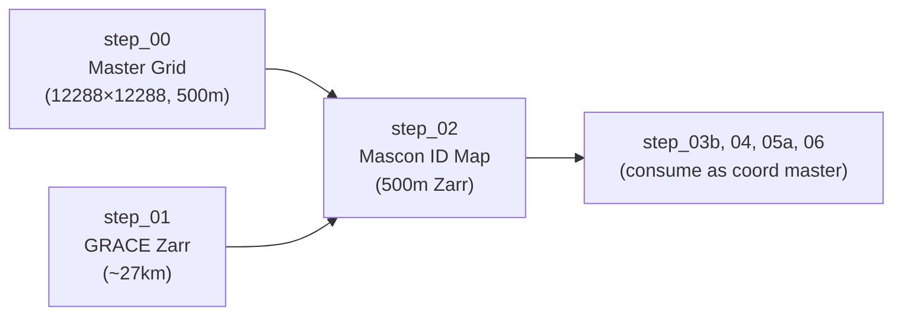

# Step 02 — Mascon ID Mapping to Master Grid

> **Script:** [`step_02_master_grid_to_zarr.py`](file:///home/scotty/dsc232_group_project/pre_pre_processing_pipeline/src/step_02_master_grid_to_zarr.py)
> **Output:** `data/processed/mascon_id_master_map.zarr`

---

## What This Script Does

This script creates the **authoritative mascon identity map** at 500m resolution by interpolating the coarser GRACE mascon IDs (from step_01, ~27.75 km resolution) onto the high-resolution master grid template (from step_00, 500m resolution).

### Detailed Breakdown

#### 1. Load Inputs
- **Master Grid Template** (`master_grid_template.nc`): The 12,288 × 12,288 coordinate skeleton from step_00, loaded with Dask chunks of `{x: 2048, y: 2048}`.
- **GRACE Zarr Store** (`grace.zarr`): Opens the output from step_01 to extract the 2D `mascon_id` variable.

#### 2. Nearest-Neighbour Reindexing
- Uses `xr.DataArray.reindex_like(ds_master, method='nearest', tolerance=30000)`.
- **Why nearest-neighbour?** Mascon IDs are discrete integers. Bilinear interpolation would average adjacent IDs (e.g., `(ID_42 + ID_43) / 2 = 42.5`), producing meaningless floats.
- **30 km tolerance**: Any pixel in the 500m grid more than 30 km from the nearest GRACE grid centre gets `NaN`. This prevents false ID assignment at the Antarctic continent edges where GRACE coverage may be sparse.

#### 3. Dask Chunk Alignment Fix
- The script includes a **critical fix** where the dataset is explicitly re-chunked to `{x: 2048, y: 2048}` before writing.
- Without this, Dask may inherit misaligned chunk boundaries from the two input datasets (master grid and GRACE), causing either:
  - Silent data corruption during Zarr write (if chunk boundaries bisect an interpolation neighbourhood).
  - Excessive task graph size (millions of tiny rechunk tasks).

#### 4. Zarr Output
- Compression: Blosc Zstd (level 5, bitshuffle).
- Metadata consolidation via `zarr.consolidate_metadata()`.
- This Zarr store becomes the **canonical coordinate master** for all subsequent steps. Steps 03b, 04, 05a, and 06 all open this store to read coordinates and inject `mascon_id` into their outputs.

### Pipeline Role

This store is used as the **coordinate authority** by at least 4 downstream scripts. Every subsequent regridding operation uses its `x` and `y` arrays, not the master grid NetCDF, ensuring pixel-exact alignment.

---

## Why Pre-Process Here?

> [!IMPORTANT]
> **Nearest-neighbour spatial reindexing on a 151M-pixel grid is an in-memory array operation that PySpark cannot express natively.**

1. **Spatial reindexing is not a SQL JOIN.** `reindex_like(method='nearest')` performs a spatial proximity lookup — finding the nearest grid cell in a different-resolution dataset. In PySpark, this would require a cross-join between the 151M-pixel master grid and the ~4,000-cell GRACE grid, followed by a distance computation per row. This is $O(N \times M)$ and would OOM on shuffle.

2. **Mascon IDs must be spatially injected.** In the downstream fusion (step_08), each 500m pixel needs its associated GRACE mascon ID to perform the mass-proportional distribution. This lookup is fundamentally a spatial operation — "which coarse GRACE cell covers this fine pixel?" — that must be resolved in the native coordinate system.

3. **This store becomes the coordinate backbone.** By creating a single authoritative Zarr at 500m, all downstream scripts can `xr.open_zarr()` and use its coordinates directly. This eliminates coordinate drift between independently processed datasets — a problem that would manifest as silent join failures in PySpark.
