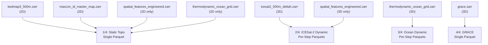

# Step 07 — Zarr-to-Parquet Flattening

> **Script:** [`step_07_flatten_zarr_to_parquet.py`](file:///home/scotty/dsc232_group_project/pre_pre_processing_pipeline/src/step_07_flatten_zarr_to_parquet.py)
> **Output:** `data/flattened/{bedmap3_static.parquet, icesat2_dynamic.parquet, ocean_dynamic.parquet, grace.parquet}`

---

## What This Script Does

This is the **dimensional bridge** of the pipeline. It transforms multidimensional Zarr stores (n-dimensional arrays with `(time, y, x)` or `(y, x)` structure) into flat, row-based Parquet tables that PySpark can read natively. The script implements a **bifurcated flattening strategy** to prevent memory explosions.

### Detailed Breakdown

#### Why Bifurcated?

A naive approach — Cartesian-join all variables into a single table — would cross-join static 2D topography (~30M ice pixels) with every time step, duplicating static columns across 84+ time steps. At 30M × 84 × 30+ columns, this equals ~75B cells → **OOM on a 64 GB machine**.

Instead, the script separates data into 4 independently flattened outputs:

#### 1/4: Static Topography + Ocean 2D → Single File

**Sources**: Bedmap3 (`surface`, `bed`, `thickness`, `mask`), mascon map (`mascon_id`), spatial features (`bed_slope`, `dist_to_grounding_line`), ocean 2D (`clamped_depth`, `dist_to_ocean`, `ice_draft`).

- All are strictly 2D `(y, x)`.
- Full 12,288×12,288 grid is loaded into a DataFrame (~10 GB combined).
- **Filtered to ice pixels only**: `mask.isin([1, 3])` — drops ocean, exposed rock, etc.
- Written as a single compressed Parquet file.

> [!NOTE]
> `mascon_id` is NOT dropped when NaN. Pixels outside the GRACE mascon domain still carry valid Bedmap3 and ocean data. The downstream GRACE join naturally returns NULL for those rows.

#### 2/4: ICESat-2 Dynamic → Per-Step Files

**Sources**: ICESat-2 (`delta_h`, `ice_area`), spatial features (`h_surface_dynamic`, `surface_slope`).

- Processed **one time step at a time**: `isel(time=i).where(ice_mask).compute().to_dataframe()`.
- Rows where `delta_h` is NaN are dropped — this is the "sparse" in "Long Sparse Parquet". ICESat-2 only observes a subset of pixels at each epoch.
- Each step writes to `step_NNN.parquet`.
- Peak memory: ~12 GB per time step.

#### 3/4: Ocean Thermodynamics → Per-Step Files

**Sources**: Ocean (`thetao`, `so`, `T_f`, `T_star`).

- Same per-step strategy as ICESat-2.
- Rows where `thetao` is NaN are dropped (grounded-ice and open-ocean pixels have no ocean interpolation).
- Each step writes to `step_NNN.parquet`.

#### 4/4: GRACE Mass Anomalies → Single File

**Source**: GRACE Zarr (`lwe_length`, `mascon_id` etc.).

- Small enough to load entirely (~hundreds of mascons × hundreds of months).
- Drops NaN `lwe_length` rows.
- Written as a single Parquet file.

### All Outputs

| Output Directory | Content | Structure | Approx Size |
|---|---|---|---|
| `bedmap3_static.parquet/` | Static ice topography + geometry | 1 file, ~30M rows | ~2 GB |
| `icesat2_dynamic.parquet/` | Elevation change per epoch | 84 files, sparse | ~15 GB |
| `ocean_dynamic.parquet/` | Ocean T/S per epoch | 84 files, sparse | ~8 GB |
| `grace.parquet/` | Mascon mass anomalies | 1 file, small | ~50 MB |

---

## Why Pre-Process Here?

> [!IMPORTANT]
> **This is the step that MAKES PySpark possible. PySpark cannot read Zarr stores, and it cannot flatten n-dimensional arrays into tabular form. This conversion must happen before upload to SDSC.**

1. **PySpark cannot read Zarr.** PySpark's `DataFrameReader` supports Parquet, CSV, JSON, ORC, and JDBC. It has no Zarr reader. Without this step, the data cannot be loaded into Spark at all.

2. **Dimensional mismatch.** Spark operates on 2D tables (rows × columns). A Zarr store with dimensions `(time=84, y=12288, x=12288)` is a 3D cube. Flattening — unrolling `(t, y, x)` into `(t_i, y_i, x_i, value)` — must happen before Spark ingestion.

3. **Memory-safe flattening requires n-dimensional awareness.** The per-time-step loop strategy (load one slice, flatten, write, GC) relies on knowing the `time` dimension structure. In PySpark, you would need to stage the full Zarr in driver memory to coordinate the flattening — defeating the purpose of distributed processing.

4. **The "sparse" optimisation.** Dropping NaN `delta_h` rows reduces the ICESat-2 data from 151M rows/step to ~2-5M rows/step (only observed pixels). This 30-95% compression saves significant storage and dramatically speeds up downstream joins.

5. **Parquet compression (ZSTD).** The output uses columnar Parquet with ZSTD compression — optimal for PySpark predicate pushdown and projection pushdown on SDSC.
