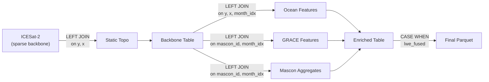

# Step 08 — Data Fusion (ICESat-2 Anchored Feature Store)

> **Script:** [`step_08_fuse_data.py`](file:///home/scotty/dsc232_group_project/pre_pre_processing_pipeline/src/step_08_fuse_data.py)
> **Output:** `data/flattened/antarctica_sparse_features.parquet/` (Hive-partitioned by `month_idx`)

---

## What This Script Does

This is the **capstone script** of the pipeline. It executes a **multi-table fusion** using DuckDB to join all four flattened Parquet tables into a single, observation-anchored ML feature store. The output is the final dataset ready for upload to SDSC and ingestion by PySpark for distributed ML training.

### Detailed Breakdown

#### Architecture: ICESat-2 Anchored Left Join

The fusion is **anchored on ICESat-2 sparse observations**. Every row in the output corresponds to a real ICESat-2 measurement — there are no synthetic/interpolated rows. This ensures the dataset respects the actual observational cadence.

#### 1/6: Register Source Views
- All four Parquet sources are registered as DuckDB views.
- **Float key normalisation**: `ROUND(y, 1)` and `ROUND(x, 1)` prevent silent equi-join failures from IEEE 754 drift between independently flattened tables.
- **Type alignment**: `CAST(mascon_id AS INTEGER)` converts NaN → NULL and ensures integer equi-joins with GRACE.

#### 2/6: Ocean Feature Engineering
Monthly ocean values are aggregated, then quarterly rolling statistics are computed:

| Feature | Computation |
|---|---|
| `thetao_mo` | `AVG(thetao)` per `(y, x, month)` |
| `t_star_mo` | `AVG(T_star)` per `(y, x, month)` |
| `so_mo` | `AVG(so)` per `(y, x, month)` |
| `t_f_mo` | `AVG(T_f)` per `(y, x, month)` |
| `t_star_quarterly_avg` | Rolling 3-month average of `t_star_mo` |
| `t_star_quarterly_std` | Rolling 3-month stddev (COALESCE to 0) |
| `thetao_quarterly_avg` | Rolling 3-month average of `thetao_mo` |
| `thetao_quarterly_std` | Rolling 3-month stddev (COALESCE to 0) |

The `COALESCE(STDDEV_SAMP(...), 0)` prevents NULL propagation when the 3-month window has fewer than 2 observations (edge months).

#### 3/6: GRACE Feature Engineering
Same quarterly rolling strategy for GRACE mass anomalies:

| Feature | Computation |
|---|---|
| `lwe_mo` | `MAX(lwe_length)` per `(mascon_id, month)` |
| `lwe_quarterly_avg` | Rolling 3-month average |
| `lwe_quarterly_std` | Rolling 3-month stddev (COALESCE to 0) |

#### 4/6: Sparse Backbone Construction
- `icesat LEFT JOIN static ON (y, x)` — attaches static topography to every ICESat-2 observation.
- Computes `month_idx = EXTRACT(YEAR FROM time) * 12 + EXTRACT(MONTH FROM time)` as the temporal join key.
- **Join-hit-rate diagnostic** — prints what percentage of backbone rows matched static data. A rate < 50% triggers a warning about coordinate misalignment.

#### 5/6: Enrichment (4-Way Join)
- Joins backbone with ocean features, GRACE features, and mascon aggregates.
- Mascon aggregates compute per-mascon-per-month metrics:
  - `n_pix`: number of ICESat-2 pixels in this mascon-month
  - `sum_abs_dh`: sum of absolute delta_h values (used for fusion weighting)

#### 6/6: Constrained Forward Modeling (lwe_fused)

The **signature feature** of this pipeline:

$$\text{lwe\_fused} = \frac{|\Delta h_i|}{\sum_j |\Delta h_j|} \times N_{pix} \times \text{lwe\_mo}$$

This distributes the mascon-level GRACE mass anomaly (`lwe_mo`) to individual pixels proportionally to their **absolute** elevation change (`|delta_h|`):

- **Mass-preserving**: `SUM(lwe_fused) = n_pix * lwe_mo` across the mascon.
- **Sign-consistent**: every pixel receives the same sign as `lwe_mo`, preventing the physical sign-flip that occurs when a mascon contains both thinning and thickening pixels.
- **Noise floor fallback**: when `mean(|delta_h|) < 0.1 mm`, ICESat-2 cannot resolve the spatial pattern → falls back to uniform distribution.

#### Output
- Hive-partitioned by `month_idx` → enables PySpark predicate pushdown (`WHERE month_idx = 24300` reads only that partition).
- ZSTD compression.
- Columns: `y`, `x`, `exact_time`, `month_idx`, 13 static/geometric columns, 4 ICESat-2 kinematic columns, 8 ocean thermodynamic columns, 3 GRACE mass columns, `lwe_fused`.

### Final Feature List (30 columns)

| Category | Features |
|---|---|
| **Coordinates** | `y`, `x`, `exact_time`, `month_idx` |
| **Static (Bedmap3)** | `mascon_id`, `surface`, `bed`, `thickness`, `bed_slope`, `dist_to_grounding_line`, `clamped_depth`, `dist_to_ocean`, `ice_draft` |
| **ICESat-2 Dynamic** | `delta_h`, `ice_area`, `surface_slope`, `h_surface_dynamic` |
| **Ocean Monthly** | `thetao_mo`, `t_star_mo`, `so_mo`, `t_f_mo` |
| **Ocean Quarterly** | `t_star_quarterly_avg`, `t_star_quarterly_std`, `thetao_quarterly_avg`, `thetao_quarterly_std` |
| **GRACE** | `lwe_mo`, `lwe_quarterly_avg`, `lwe_quarterly_std` |
| **Fused** | `lwe_fused` |

---

## Critique

> [!NOTE]
> Using DuckDB instead of PySpark for this fusion step is a pragmatic choice for local pre-processing. DuckDB executes SQL analytically on a single machine with excellent memory management (`temp_directory` for out-of-core spill). However, the fusion logic is written entirely in SQL, which means it can be directly ported to PySpark SQL if the dataset grows beyond single-node capacity.

> [!WARNING]
> The `ROUND(y, 1)` / `ROUND(x, 1)` fix is critical but fragile. If any upstream step changes coordinate precision (e.g., from float32 to float64), the rounding tolerance may need adjustment. A more robust approach would be to integer-encode coordinates as `CAST(y * 2 AS BIGINT)` (since 500m grid → all coordinates are multiples of 500).

---

## Why Pre-Process Here?

> [!IMPORTANT]
> **While this step uses SQL (DuckDB) and could theoretically run in PySpark, the pre-processing does it locally because the input is intermediate data that will never be uploaded to SDSC in raw form.**

1. **Intermediate flattened Parquets are too large to upload separately.** The 4 unfused Parquet directories total ~25 GB. Uploading them separately and fusing on SDSC would waste cluster boot time and I/O bandwidth.

2. **The fusion creates the final feature store.** By performing the 4-way join, feature engineering (quarterly lags), and constrained forward modeling locally, the output is a single **ready-to-train** dataset. PySpark on SDSC needs only to `spark.read.parquet(path)` and begin ML.

3. **DuckDB is more efficient than PySpark for single-node analytics.** DuckDB's vectorised execution engine, columnar processing, and out-of-core spill to disk make it ~5-20× faster than PySpark for this workload on a single machine. PySpark's overhead (JVM startup, executor serialisation, shuffle) is wasted when the data fits on one node.

4. **Hive partitioning by `month_idx` enables downstream PySpark predicate pushdown.** When PySpark reads the fused parquet, it can prune partitions at the file level — only scanning the months needed for a query. This is the key integration point between the local pipeline and SDSC.
